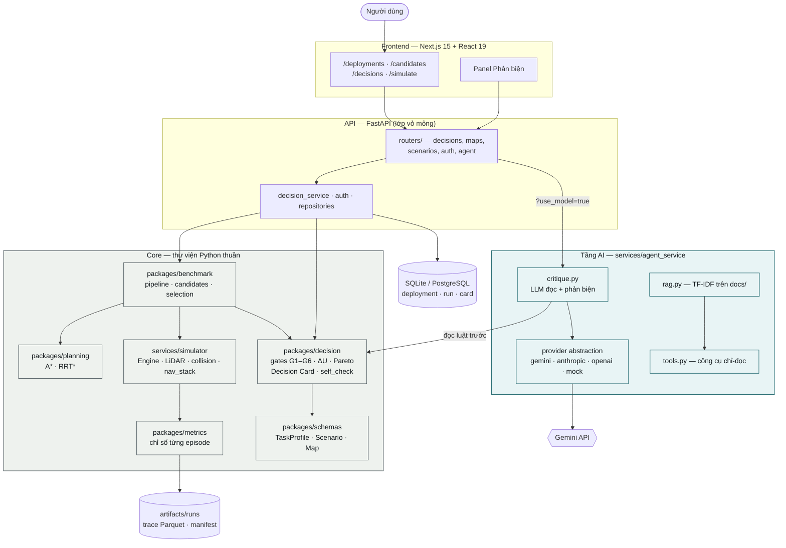
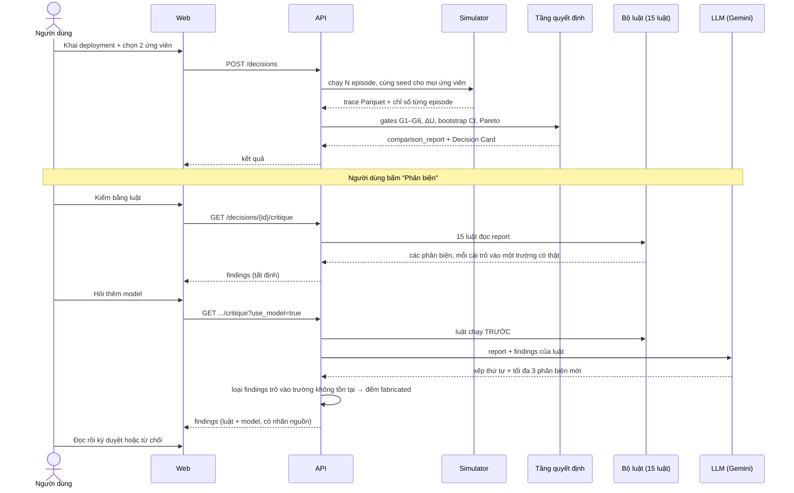

# Kiến trúc PlanBench

Nền tảng so sánh thuật toán điều hướng robot AMR/AGV. Người dùng khai một
**deployment** (thế giới cần đo), đăng ký các **ứng viên** (stack thuật
toán), chạy một **phép so**, rồi ký duyệt kết quả. Simulator sinh ra mọi
con số; LLM đọc và chất vấn chúng nhưng không bao giờ tạo ra chúng.

Ba nguyên tắc chi phối mọi thứ bên dưới:

- **Core-first.** `packages/` và `services/simulator/` là thư viện Python
  thuần, không import FastAPI, ROS2 hay frontend. API chỉ là lớp vỏ mỏng.
- **Contract-first.** Model Pydantic trong `packages/schemas/` là nguồn
  sự thật duy nhất của kiểu domain.
- **Determinism-first.** Mọi thành phần nhận seed và config tường minh;
  cùng input cho cùng output. Đây là lý do LLM bị giữ ngoài đường tính toán.

## Sơ đồ hệ thống

## Luồng dữ liệu chính

Đây là luồng người dùng end-to-end mà MVP hiện thực:

## LLM đứng ở đâu — và không đứng ở đâu

| Giai đoạn | Ai làm | Vì sao |
|---|---|---|
| Khai deployment, chọn ứng viên | Người | Là câu hỏi cần trả lời |
| Sinh episode, chạy simulator | Code | Phải tái lập được |
| Gates G1–G6, ΔU, khoảng tin cậy | Code | Cùng input phải cho cùng kết luận |
| **Phản biện theo luật** | **Code** | Là baseline mà LLM phải vượt |
| **Xếp thứ tự, diễn giải, bổ sung phản biện** | **LLM** | Cần phán đoán, không cần tái lập |
| Ký duyệt, chịu trách nhiệm | Người | Không uỷ quyền được |

**LLM không bao giờ sinh ra một con số.** Nó đọc số đã có và chất vấn kết
luận rút ra từ chúng.

## Ràng buộc giữ LLM trong khuôn

Cài trong `services/agent_service/planbench_agent/critique.py`:

1. **Luật chạy trước và sống sót mọi lỗi.** Provider ném exception, trả
   prose thay vì JSON, hay bịa toàn bộ trích dẫn — phần tất định vẫn về
   đủ.
2. **Model không được bỏ phản biện nào của luật.** Thiếu mã trong
   `ranked_rule_codes` thì nó giữ thứ tự cũ, không biến mất.
3. **Mọi `field_path` phải resolve được** trong report, dùng đúng hàm
   `resolve()` mà luật bị ràng buộc. Không resolve được thì bị loại và
   đếm vào `fabricated` — con số này được **công bố**, không giấu.
4. **Nhãn `source`** tách `rule` với `model` trên từng phản biện, để
   người đọc biết nửa nào tái lập được.
5. **Cấm ngôn ngữ** (`assert_no_banned_language`): nói "an toàn" cạnh một
   con số thì mất đoạn văn, giữ nguyên phần luật.
6. **Trần 3 phản biện** cho model, chặn kiểu phịa cho tới khi nghe có vẻ
   nghiêm trọng.

## Lưu trữ

| Nơi | Chứa gì | Vì sao ở đó |
|---|---|---|
| SQLite / PostgreSQL | deployment, ứng viên, decision run, Decision Card, nhật ký duyệt | Cần truy vấn và phân quyền |
| `artifacts/runs/` | trace Parquet mỗi episode, manifest, Decision Card dạng file | Trace nặng vài MB mỗi episode; card và manifest là hồ sơ nghiệm thu nên được commit vào repo |
| `docs/` | tài liệu Markdown | RAG index từ đây bằng TF-IDF, không dùng vector DB — để trích nguồn ổn định và chạy offline |

## Thành phần ngoài

| Dịch vụ | Bắt buộc? | Thiếu thì sao |
|---|---|---|
| Gemini API | không | Rơi về mock tất định, có ghi log rõ |
| PostgreSQL | không | Dùng SQLite cạnh repo |
| MLflow | không | Tự tắt tracking |
| Google / GitHub OAuth | không | Nút đăng nhập tương ứng không hiện; dùng dev login |

Không có dependency nào là điều kiện để chạy. Thiếu thì tính năng tương
ứng **giảm chế độ có báo**, không crash.
