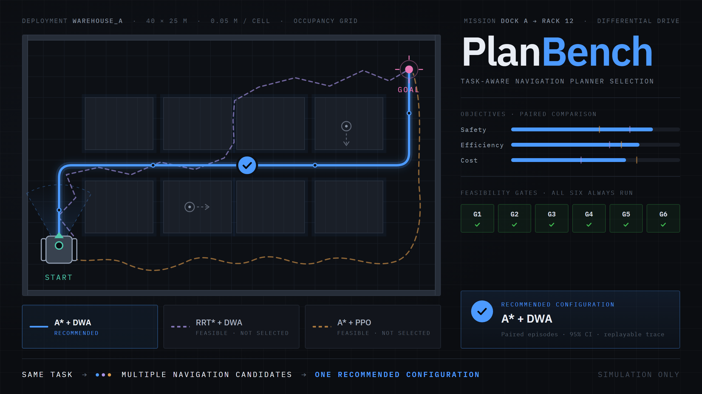

# Agentic AI PlanBench

Nền tảng mô phỏng và so sánh thuật toán điều hướng cho robot di động
AMR/AGV - và, quan trọng hơn, một quy trình để **trả lời câu hỏi "nên
triển khai thuật toán nào"** bằng bằng chứng người khác kiểm lại được.

**Tải app tại:** [https://github.com/hungnguyen-1601/T011-rav19-planbench/releases/latest/download/PlanBench-Setup.exe](https://github.com/hungnguyen-1601/T011-rav19-planbench/releases/latest/download/PlanBench-Setup.exe)

**Chỉ mô phỏng - không điều khiển robot thật.**



---

## 1. Bài toán

Chọn thuật toán điều hướng cho một kho hàng cụ thể là một quyết định tốn
kém và khó rút lại. Nhưng phần lớn cơ sở để chọn lại đến từ những thứ
không so được với nhau: một con số trong paper chạy trên map khác, một
lần demo may mắn, một bảng benchmark không nói nó chạy bao nhiêu lần.

**Đo trên robot thật thì đắt, chậm, và không lặp lại được.**

- Mỗi lượt chạy tốn hàng chục phút, và một phép so tử tế cần hàng chục
  lượt. Vài ngày công cho một câu trả lời.
- Cần robot rảnh, kho trống và người trực - ba thứ hiếm khi rảnh cùng lúc.
- Một lần va chạm là hỏng cảm biến, hỏng hàng, hoặc tệ hơn. Thử một
  thuật toán chưa biết trên sàn đang có người là rủi ro không ai muốn ký.
- **Không dựng lại được tình huống đã hỏng.** Sàn hôm nay khác hôm qua,
  có người đi ngang, pin yếu hơn. Cái lỗi vừa thấy không tái hiện được thì
  cũng không sửa chắc được.
- Chạy A tuần này, B tuần sau - thế giới đã đổi, và hiệu số giữa hai lần
  đo không còn là hiệu số giữa hai thuật toán.

**Và ngay cả khi đã đo, phép so vẫn hỏng theo ba cách:**

- **Không cùng điều kiện.** Hai thuật toán chạy trên hai bộ seed khác
  nhau, hai cấu hình LiDAR khác nhau, rồi hiệu số được đọc như thể nó đo
  thuật toán.
- **Không đủ số lần.** "Không va chạm lần nào" trên 5 lượt chạy không
  phải một lời hứa về an toàn - nó là một quan sát trên 5 lượt chạy.
- **Kết luận nghe mạnh hơn dữ liệu.** "A tốt hơn B" nói ra dễ hơn nhiều
  so với "A hơn B 0,039 utility, khoảng tin cậy 95% [0,036; 0,042], trên
  30 episode ghép cặp, dưới phân phối kịch bản đã mô phỏng".

PlanBench tồn tại để câu thứ ba là câu duy nhất hệ thống cho phép nói.

## 2. Tầm nhìn

Một nơi mà **bất kỳ ai cũng cắm được thuật toán của mình vào**, chạy nó
trên đúng thế giới mà đối thủ của nó đã chạy, và nhận về một kết luận
**mang đi bảo vệ trước người khác được** - kèm đủ bằng chứng để người đó
phản biện lại.

Sáu hướng dựng nên nền tảng đó.

### Công bằng phải đo được, không phải hứa

Cùng map, cùng scenario, cùng seed, cùng cấu hình cảm biến, cùng vật cản
động ở cùng thời điểm. Và mỗi điều kiện mang một checksum, để câu "hai
bên chạy cùng điều kiện" là một thứ kiểm lại được chứ không phải một lời
người chạy benchmark tự khai.

Episode ghép cặp theo `episode_context`: hiệu số tính theo từng cặp, chứ
không phải giữa hai trung bình rời nhau. Một chênh lệch ghép cặp loại bỏ
được nhiễu do "hôm ấy map dễ hơn".

### Kết luận không được vượt quá bằng chứng

Mọi con số đi kèm khoảng tin cậy và số lần chạy đứng sau. Cổng khả thi
tách hẳn khỏi điểm số - cái nào *được xét* và cái nào *tốt hơn* là hai
câu hỏi, trộn chúng là cách một stack va chạm được cứu bằng việc nó nhanh.

Và có những chữ hệ thống **không được phép** nói ra. "An toàn",
"sẵn sàng production", "TCO" - không cạnh một con số nền tảng này sinh ra.
Danh sách đó là một danh sách thật, có hàm kiểm và có test canh, chứ
không phải một lời dặn trong tài liệu.

### Nói được *vì sao*, không chỉ *ai thắng*

Biết A hơn B 0,039 utility là biết một nửa. Nửa còn lại - *cơ chế nào
tạo ra chênh lệch đó* - mới là thứ người đọc mang đi quyết định được:
khe hành lang hẹp hơn footprint cộng inflation, ngân sách sampling cắt
quá thấp, controller dao động trong khe hẹp.

Hướng đi: một thang bằng chứng bốn mức (`observed` → `associated` →
`mechanism_verified` → `intervention_supported`), một bộ checker tất định
đóng dấu từng mức, và **không có mức thứ năm cho "không biết"** - thiếu
bằng chứng nghĩa là không có claim, không phải một claim yếu.

Vai của AI ở đây là **sinh giả thuyết**, vì không gian tổ hợp (cơ chế ×
hình học bản đồ × cấu hình cụ thể) quá lớn cho một bộ luật cứng. Nhưng AI
không bao giờ là nguồn của một con số, một dấu xác nhận, hay một kết luận
nhân quả - nó đề xuất, tầng tất định kiểm chứng và đóng dấu.

### Ai cũng cắm được thuật toán của mình vào

Không chỉ so các stack có sẵn. Một nhóm mang global planner hoặc local
controller của riêng họ tới, đăng ký qua SDK, và nó đi qua **đúng bộ cổng
và đúng phép so** như mọi stack khác - không có đường tắt cho thuật toán
nhà làm.

Kèm theo là những thứ làm điều đó an toàn: lane subprocess cho code chưa
tin được, CLI kiểm tính tuân thủ trước khi chạy thật, và một hệ thống quy
trách nhiệm theo **thành phần** chứ không theo tên thuật toán - vì một
ứng viên là cả một stack, và "A* thắng RRT*" thường là một câu sai địa
chỉ.

### Người quyết định, không phải hệ thống

Nền tảng chạy phép so, dựng bằng chứng, và chỉ ra chỗ lập luận yếu. Nó
**không** tự duyệt, không tự áp dụng, không tự đưa lên production. Việc
chấp nhận một kết quả là một hành động của con người, và có thể nhờ người
thứ hai review - trước khi chạy (spec) hoặc sau khi chạy (result).

Cùng tinh thần đó ở tầng AI: model được xếp lại thứ tự lời khuyên và thêm
ý mới, nhưng **không xoá được** thứ bộ luật đã nói.

### Kết quả phải mang ra khỏi hệ thống được

Một phép so chỉ có giá trị khi người không dùng nền tảng này đọc được nó.
Xuất Markdown và Excel, hai thứ tiếng, mở đầu bằng một trang trả lời
"run này ra cái gì" mà không bắt người đọc ghép từ ba tab. Trace và
artifact lưu ngoài database kèm checksum, để một lượt chạy được **phát
lại** chứ không chỉ được thuật lại.

Đích xa: một đội robot mới, chưa biết gì về nền tảng, khai thế giới của
họ trong một buổi chiều, cắm hai thuật toán vào, và ra về với một tài
liệu mà quản lý của họ đọc hiểu được.

## 3. MVP hiện tại - cái gì đang chạy được

### 3.1. Khai một thế giới để đo - **Triển khai**

Một *deployment* (task profile) là toàn bộ những gì cố định trong phép
so: map, robot (kích thước, động học, chu kỳ điều khiển), cảm biến và
nhiễu của nó, các mission, vật cản động, ngưỡng khả thi, và bộ trọng số
mục tiêu.

Mọi ngưỡng cổng đọc từ đây, **không một hằng số nào nằm trong code** -
một ngưỡng viết cứng là một ngưỡng không ai đặt ra.

### 3.2. Thử trước khi tốn hàng giờ - **Sân thử**

Chạy một episode đơn, xem quỹ đạo, clearance, latency planner theo thời
gian thực. Đây là chỗ phát hiện map thiếu tường bao hay mission bất khả
thi, trước khi phóng một phép so 30 episode.

### 3.3. Phép so ghép cặp - **Quyết định**

Hai ứng viên chạy trên **cùng một tập `episode_context`**: cùng seed,
cùng vị trí vật cản, cùng nhiễu cảm biến. Hiệu số được tính theo từng
cặp, không phải giữa hai trung bình rời nhau.

Stack **tranh được thắng thua** (`production_eligible`): `astar+dwa` ·
`astar+dwa_predictive` · `rrtstar+dwa` · `rrtstar+dwa_predictive` ·
`astar+ppo`.

`astar+pure_pursuit` và `rrtstar+pure_pursuit` cũng có trong registry
nhưng mang `reference=True`: chúng **bỏ qua cảm biến**, tồn tại để chạy
thử đường ống, và mô tả trong code nói thẳng là không được dùng để rút kết
luận benchmark. Trích danh sách stack ở đâu thì trích kèm cờ này - xem
`docs/reference/decision-log.md` mục D12.

### 3.4. Sáu cổng khả thi - G1 đến G6

Cổng chạy **trước** mọi phép chấm điểm, và **một cổng không phải là một
điểm số**: chấm điểm trả lời "cái nào tốt hơn", cổng trả lời "cái này có
được xét đến không". Một stack va chạm không được cứu bằng việc nó nhanh.

Bốn tính chất đáng nhớ:

- **Cả sáu cổng luôn chạy.** Không dừng ở cổng hỏng đầu tiên - "bị loại
  ở G2" mà không biết G4 có hỏng không là một chẩn đoán không hành động
  được.
- **Không va chạm là một chặn trên, không phải một chứng chỉ.** Quan sát
  0 va chạm trong N lượt chỉ chặn xác suất ở mức ~3/N với độ tin cậy 95%,
  và chỉ dưới phân phối kịch bản đã mô phỏng. G2 vì thế đòi thêm
  `N ≥ N_min`, và câu chặn trên đi kèm mọi lần con số đó được nhắc.
- **Sàng lọc trên host chỉ chứng minh một chiều.** Máy chạy benchmark
  nhanh hơn bo mạch đích và chạy Python chứ không phải C++/ROS2. G4/G5
  hỏng thì chắc chắn hỏng trên đích; G4/G5 đạt thì **không chứng minh
  được gì** - và mọi kết quả G4 mang theo câu cảnh báo đó nguyên văn.
- **Có những chữ hệ thống không được phép nói.** "An toàn" và "TCO" không
  bao giờ xuất hiện cạnh một con số nền tảng này sinh ra; có hàm kiểm và
  có test CI canh.

### 3.5. Thẻ quyết định

Khi cả hai ứng viên qua cổng: ΔU ghép cặp + khoảng tin cậy 95% bootstrap,
phân rã theo từng mục tiêu, và số episode đứng sau. Khoảng tin cậy vắt
qua 0 thì thẻ nói thẳng là run này **không** chứng minh được chênh lệch
nó báo.

Kèm theo: bảng so sánh từng metric, **Nên triển khai cái nào** theo ba
tình huống (ưu tiên chất lượng / real-time, ít bộ nhớ / cần cả hai), và
danh sách ứng viên bị loại kèm cổng đã loại chúng.

### 3.6. Tầng giải thích - bằng chứng để phản biện

- **Waterfall ΔU**: chênh lệch tổng phân rã thành từng mục tiêu, mỗi
  thanh có khoảng tin cậy riêng; thanh vắt qua 0 hiển thị mờ.
- **Phát lại hai canvas**: cùng một episode, hai stack, một playhead
  chung theo thời gian tuyệt đối.
- **Exemplar**: episode điển hình / thắng đậm nhất / thua đậm nhất /
  nặng về an toàn nhất - chọn theo công thức cố định, không phải theo
  thứ tự tình cờ.
- **Detector**: `detour`, `stuck_cluster`, `replan_storm`, `oscillation`,
  `latency_spike`, `near_miss_cluster` - hàm thuần của trace, test như
  metric.
- **Thang bằng chứng bốn mức** (`observed` → `associated` →
  `mechanism_verified` → `intervention_supported`) và **không có mức thứ
  năm cho "không biết"**: thiếu bằng chứng nghĩa là **không có claim**,
  không phải một claim yếu.
- **16 tool card + 4 mechanism checker** đã chạy được, và sidecar ghi lại
  mọi lần planner được gọi - kể cả những lần nó trả `no_path`, vốn là ca
  cần giải thích nhất.

### 3.7. Lớp AI

Hai thứ khác nhau, đừng nhầm:

|             | Trợ lý hội thoại                                                     | Lớp cố vấn                                                                        |
| ----------- | ------------------------------------------------------------------------ | ------------------------------------------------------------------------------------ |
| Ở đâu    | dock nổi trên mọi trang + trang **Trợ lý AI**                  | nút *Hỏi thêm model* trên các panel advice                                     |
| Làm gì    | đọc bản ghi bằng **11 tool chỉ-đọc** rồi trả lời          | xếp lại thứ tự advice luật + thêm **tối đa 3** ý                       |
| Ràng buộc | không chạy được phép so, không sửa deployment, không duyệt gì | không xoá được advice luật, mọi ý thêm phải trỏ vào một field có thật |

Bốn luật của lớp cố vấn, mỗi luật có test và mỗi test đã được chứng minh
là **bắt được lỗi thật** bằng cách tiêm lỗi vào rồi đòi nó đỏ:

1. Tầng luật là sàn - model sắp lại được, bỏ bớt thì không.
2. Citation trỏ vào field không tồn tại thì bị bỏ và **đếm công khai**.
3. Model không đẩy được cảnh báo `blocking` xuống dưới `disclosure`.
4. Provider chết thì mất phần văn, không mất tầng luật.

Dock biết **run đang mở trên màn hình** - nó gửi kèm định danh, server tra
lại qua đúng gateway mà tool đi qua, và chip trên khung chat nói rõ câu
hỏi đang gắn với run nào (bấm một cái là gỡ).

### 3.8. Cắm thuật toán của bạn vào

**Algorithm Host** + plugin SDK: đăng ký global planner hoặc local
controller của riêng bạn, chạy trong lane tin cậy hoặc lane subprocess,
đi qua đúng bộ cổng và đúng phép so như stack có sẵn. Có CLI kiểm tính
tuân thủ trước khi chạy thật.

**Kho mô hình**: upload checkpoint PPO `.zip`, kiểm checksum và tương
thích với robot profile. Không có nút xoá - một model là thứ một benchmark
đã chạy, xoá dòng đó biến kết quả thành bản ghi của hư không.

### 3.9. Xuất và chia sẻ

Markdown và Excel, **hai thứ tiếng** (Việt/Anh), mở đầu bằng một trang
Summary trả lời "run này ra cái gì" mà không bắt người đọc ghép từ ba tab.
Có link chia sẻ báo cáo.

### 3.10. Phần còn lại của nền tảng

Đăng nhập Google/GitHub (hoặc dev login cục bộ) · quy trình duyệt **tùy
chọn**, nhờ người khác review spec hoặc result · bản đồ vẽ tay · thư viện
kịch bản dựng sẵn · giao diện Việt/Anh, sáng/tối/theo hệ thống · SQLite
mặc định, PostgreSQL + Alembic khi cần · Docker Compose.

## 4. Hướng dẫn sử dụng PlanBench

Phần này nói **cách vận hành nền tảng**: đi từ chỗ chưa có gì tới một
phép so đọc được. Cách khởi động ứng dụng nằm ở §5.

Thứ tự dưới đây là thứ tự phụ thuộc - mỗi bước cần thứ bước trước tạo ra.
Bỏ qua được những bước đã có sẵn dữ liệu: định dùng bản đồ và kịch bản
dựng sẵn thì bắt đầu thẳng từ §4.3.

**Không phải tài khoản nào cũng làm được mọi bước.** Ai được làm gì nằm ở
§4.11; đọc trước nếu một nút không hiện ra ở chỗ hướng dẫn nói là có.

### 4.1. Bản đồ - vẽ thế giới robot chạy trong đó

Vào **Bản đồ**.

- **Tạo bản đồ** - chọn *Bản đồ kho mới* (có sẵn kệ và lối đi) hoặc *Bản
  đồ trống mới*, rồi đặt kích thước và độ phân giải.
- **Nạp bản đồ mẫu** nếu chỉ muốn thử nhanh.
- Bấm vào một bản đồ để mở **Trình sửa bản đồ**. Chọn bút *Vật cản* hoặc
  *Trống*, rồi bấm và kéo để vẽ. Bấm **Lưu thay đổi**.

Mỗi lần lưu tạo một **phiên bản mới** kèm checksum, không ghi đè bản cũ.
Một run đã chạy trên bản đồ nào thì vẫn trỏ đúng vào bản đó.

> Bản đồ **phải có tường bao kín**. Robot ra khỏi mép bản đồ là một tình
> huống hệ thống không mô tả được.

### 4.2. Kịch bản - mission và vật cản động

Hai đường, chọn một.

**Đường nhanh - Thư viện kịch bản.** Vào **Thư viện kịch bản**, xem trước
một mục (*Xem trước* không lưu gì cả), rồi bấm **Import**. Một lần import
tạo **cả bản đồ lẫn kịch bản** - đi đường này thì §4.1 không cần làm.

**Đường tự khai.** Vật cản động và mission khai thẳng trong form cấu hình
triển khai ở bước sau, không cần mở trình soạn kịch bản riêng.

### 4.3. Cấu hình triển khai - khai thế giới cần đo

Vào **Triển khai** → **Tạo cấu hình triển khai**. Hai chế độ, cùng kết
quả:

- **Điền ô** - form theo nhóm: *Danh tính* · *Robot* · *Ngưỡng* · *Nhiễu
  đã khai* · *Vật cản động* · *Mission*. Mỗi ô có dấu **?** giải thích ô
  đó dùng làm gì.
- **Dán YAML** - dán thẳng một profile, hoặc copy một file từ thư mục
  `profiles/` trong repo rồi sửa.

Khai lần lượt:

1. **Danh tính** - mã cấu hình, mức tuyên bố, vai trò.
2. **Robot** - bán kính, tốc độ và gia tốc tối đa, chu kỳ điều khiển.
3. **Ngưỡng** - thế nào là *đạt* trên thế giới này: tỷ lệ thành công tối
   thiểu, rủi ro va chạm chấp nhận được, dung sai đích, giới hạn thời
   gian một episode, ngưỡng kẹt, khoảng hở cảnh báo.
4. **Nhiễu đã khai** - σ tầm LiDAR và tỷ lệ trượt bánh. Để trống nghĩa là
   khai một thế giới không nhiễu, và giao diện hiển thị đúng như vậy.
5. **Vật cản động** - thêm từng vật cản, đặt tuyến đi và tốc độ.
6. **Mission** - điểm xuất phát và đích.

Bấm **Nộp**. Form nói rõ phần nào đã đủ.

> **Nộp lại cùng một mã với nội dung khác sẽ bị từ chối, không phải gộp.**
> Mã cấu hình là danh tính của một thế giới; sửa nội dung dưới cùng cái
> tên biến mọi kết quả cũ thành kết quả của một thứ khác.

### 4.4. Ứng viên - cái đem ra so

Vào **Ứng viên**. Trang này có ba phần:

- **Thuật toán hiện có trong hệ thống** - các bộ lập kế hoạch toàn cục và
  bộ điều khiển cục bộ, kèm loại quan sát mỗi cái cần.
- **Stack trong registry** - các tổ hợp đã ghép sẵn.
- **Đăng ký một ứng viên** - chọn stack, chọn cấu hình controller, khai
  phần tinh chỉnh nếu có, rồi bấm **Đăng ký**.

Không bắt buộc đăng ký trước: bước chạy phép so cũng chọn được stack và
controller ngay tại chỗ. Đăng ký hữu ích khi muốn dùng lại đúng một cấu
hình nhiều lần và có id để tra.

Ứng viên là một **policy đã huấn luyện**: vào **Mô hình** → *Tải mô hình
lên*, đính file `.zip`, khai tên, phiên bản và robot mà nó được huấn
luyện cho. Model đã benchmark thì sửa được nhãn nhưng **không đổi được
file** - id của nó phải tra ra được.

### 4.5. Sân thử - chạy thử một episode

Vào **Sân thử**. Đây là chỗ kiểm xem thế giới vừa khai có chạy được
không, trước khi phóng một phép so dài.

1. Chọn **bản đồ**, **kịch bản** và **thuật toán**.
2. Bấm để đặt **điểm xuất phát** và **đích** ngay trên bản đồ.
3. Bấm **Chạy mô phỏng**.

Xem lại bằng **Phát / Tạm dừng / Chạy lại**, kéo **thanh thời gian** tới
đúng khoảnh khắc cần xem, đổi **tốc độ** phát. Bật tắt từng lớp hiển thị:
*Lưới*, *Đường toàn cục*, *Quỹ đạo thực tế*.

Ba thứ đáng nhìn: robot có tới được đích không, đường toàn cục có hợp lý
không, và quỹ đạo thực tế bám đường đó tới đâu.

### 4.6. Quyết định - chạy phép so

Vào **Quyết định** → **Chạy một phép so**.

1. **Cấu hình triển khai** - chọn thế giới vừa khai.
2. **Ứng viên A** và **Ứng viên B** - mỗi bên chọn bộ lập kế hoạch toàn
   cục, bộ điều khiển cục bộ, và cấu hình của controller.
3. **Số episode** - để trống thì dùng đúng số cấu hình triển khai yêu cầu.
4. Bấm **Xếp hàng**.

> **Đổi đúng một thành phần mỗi lần.** So `astar+dwa` với `rrtstar+dwa`
> thì hiệu số quy được cho bộ lập kế hoạch toàn cục. Đổi cả hai tầng cùng
> lúc thì kết quả không nói được thành phần nào tạo ra chênh lệch.

Run chạy nền - đóng tab cũng không sao. Trang **Quyết định** liệt kê mọi
run kèm trạng thái; lọc được theo cấu hình triển khai hoặc theo kết cục.

Một run **không xếp hạng ai** vẫn là một kết quả, không phải một thất bại.
Danh sách nói rõ lý do: chỉ một ứng viên qua đủ cổng, không ứng viên nào
qua, cấu hình triển khai không xếp hạng được, hay run bị dừng giữa chừng.

### 4.7. Đọc kết quả

Mở một run. Trang đọc từ trên xuống theo đúng thứ tự nên đọc:

| Mục                                 | Trả lời câu gì                                                          |
| ------------------------------------ | --------------------------------------------------------------------------- |
| **Run này kết luận gì**    | ai thắng, cách biệt bao nhiêu, khoảng tin cậy có vắt qua 0 không   |
| **Nên triển khai cái nào** | khuyến nghị theo ba tình huống ưu tiên khác nhau                     |
| **Kết quả so sánh**         | từng metric, bên nào dẫn, chênh bao nhiêu                             |
| **Bảng cổng**                | ai bị loại, ở cổng nào, với bằng chứng gì                          |
| **Episode**                    | từng lượt chạy đạt hay trượt; lọc riêng những lượt có trượt |
| **Phát lại**                 | hai canvas cùng một episode, một playhead chung                          |
| **Phản biện**                | chỗ nào trong lập luận này yếu                                        |

Ở mục **Phản biện**, bấm **Kiểm bằng luật** trước - nó chạy bộ luật tất
định, không cần cấu hình gì. **Hỏi thêm model** là lớp AI phía trên, cần
key (§5.5).

Cuối trang là **Đọc, và quyết định**: ghi chú lại kết luận của bạn, đánh
dấu đã đọc, và nếu muốn áp dụng thì **Duyệt làm cấu hình** rồi tải
`approved_config.yaml`.

### 4.8. Dùng AI

Hai lớp AI, hai chỗ khác nhau, hai việc khác nhau.

#### Trợ lý hội thoại

Dock nổi góc phải màn hình, có mặt trên mọi trang; bản đầy đủ ở trang
**Trợ lý AI**.

Nó đọc những gì nền tảng đã ghi rồi trả lời. Hỏi được:

- *"Cấu hình triển khai này có những run nào?"*
- *"Run này kết luận gì? Ai thắng và cách biệt bao nhiêu?"*
- *"Ứng viên nào bị loại ở cổng nào?"*
- *"Nên chọn thuật toán nào cho cấu hình triển khai này?"*
- *"Bản báo cáo có chỗ nào đáng nghi không?"*

Mở dock trên trang một run thì nó **tự gắn với run đó** - chip trên khung
chat nói rõ điều đó, và bấm một cái là gỡ để hỏi chuyện khác.

Nó **không** chạy được phép so, không sửa được cấu hình triển khai, không
duyệt được gì. Và nó chỉ nói những gì tool trả về - hỏi một thứ chưa được
ghi lại thì nó nói là chưa có, chứ không đoán.

#### Lớp cố vấn

Nút *Hỏi thêm model* trên các panel lời khuyên trong trang một run.

Không có ô nhập; bấm nút là chạy. Nó nhận danh sách lời khuyên bộ luật đã
sinh, sắp lại theo cái nên xử lý trước, và thêm vài ý mà luật không nhìn
thấy - mỗi ý phải trỏ vào một trường có thật trong dữ liệu.

Kết quả hiển thị tách rõ ý nào của **luật**, ý nào của **model**, kèm số
ý bị bỏ vì trỏ vào chỗ không tồn tại. Model không xoá được lời khuyên của
luật, và không đẩy được một cảnh báo chặn xuống dưới một ghi chú.

Chưa cấu hình key thì cả hai lớp chạy bằng bộ khớp từ khoá offline, và
giao diện nói thẳng điều đó. Cách bật model thật: §5.5.

### 4.9. Mang kết quả ra ngoài

Trên trang một run:

- **Xuất Markdown** - bản đọc được, hợp để dán vào tài liệu.
- **Xuất Excel** - mở đầu bằng trang Summary, rồi tới bảng metric và phân
  rã mục tiêu. Số là số chứ không phải chữ, nên sắp xếp và lọc được.
- **Chia sẻ báo cáo** - link cho người không có tài khoản.

Cả hai bản xuất theo đúng ngôn ngữ đang chọn trên giao diện.

### 4.10. Nhờ người khác duyệt

Không bắt buộc. Bấm *Gửi đi duyệt*, nhập nickname người cần xem, chọn
duyệt **spec** (trước khi chạy) hay **result** (sau khi chạy).

Khi đang chờ, **chính chủ không tự duyệt được** - đó là toàn bộ ý nghĩa
của việc nhờ. Hủy yêu cầu lúc nào cũng được. Việc đang chờ bạn nằm ở
trang **Duyệt**.

### 4.11. Ai được làm gì - ba gói quyền

PlanBench chia quyền thành **ba gói độc lập**: `engineer`, `reviewer`,
`admin`. Chúng **không lồng nhau** - reviewer không phải engineer cấp
cao, admin không phải reviewer cấp cao. Một người giữ cả ba, hoặc một,
hoặc không gói nào.

Lý do không xếp bậc thang: publish một thuật toán là **chữ ký của
reviewer**, không phải đặc quyền của người quản trị. Cho admin quyền đó
vì "admin thì làm gì cũng được" là biến một chữ ký thành một cấp bậc.

| Việc                                                       | engineer | reviewer | admin |
| ----------------------------------------------------------- | :------: | :------: | :---: |
| Đọc map, scenario, deployment, kết quả                  |    ✅    |    ✅    |  ✅  |
| Xem catalogue thuật toán                                  |    ✅    |    ✅    |  ✅  |
| Tạo/sửa map, scenario, deployment                         |    ✅    |          |      |
| Chạy mô phỏng, chạy so sánh                            |    ✅    |    ✅    |      |
| Gửi một run đi duyệt                                    |    ✅    |          |      |
| Nhận, đọc và **ký duyệt** một run               |          |    ✅    |      |
| Thu hồi phê duyệt                                        |          |    ✅    |      |
| Import thuật toán, xem mã,**xuất bản**           |          |    ✅    |      |
| Tắt một thuật toán (lý do quản trị)                  |          |    ✅    |      |
| Tắt một thuật toán (**kill switch** lúc sự cố) |          |          |  ✅  |
| Cấp/thu quyền, khoá tài khoản                          |          |          |  ✅  |
| Đọc nhật ký phân quyền                                |          |    ✅    |  ✅  |
| Đổi cấu hình hệ thống                                 |          |          |  ✅  |

Reviewer **chạy mô phỏng được** - để tự xem một thuật toán chưa xuất bản
cư xử thế nào trước khi bảo lãnh nó. Không có quyền đó thì reviewer phải
nhờ engineer chạy hộ đúng thứ mình sắp ký.

Admin **không duyệt run và không xuất bản thuật toán**. Đường duy nhất
admin chạm vào một thuật toán là kill switch, và nó ghi vào nhật ký dưới
một tên khác với `algorithm.disable` - vì đó là hai việc khác nhau, và
chờ reviewer có mặt không phải là cách ứng phó sự cố.

#### Duyệt một run: bốn bước

Gửi → Nhận → Đọc → Ký.

1. **Gửi** - *chủ run* làm, và kiểm theo quyền sở hữu chứ không theo
   role: người khác dù có quyền cũng không gửi hộ được. Để trống ô
   reviewer thì run vào **hàng chờ chung**; điền tên thì gửi đích danh.
2. **Nhận** - reviewer lấy nó khỏi hàng chờ. Hai người không cùng giữ
   một run.
3. **Đọc** - nói "tôi đã đọc bằng chứng". Việc này gắn vào **lần nhận**,
   không gắn vào run: ai nhận lại từ người khác thì phải tự đọc lại.
4. **Ký** - duyệt hoặc từ chối, bắt buộc kèm nhận xét.

Reviewer **không có quyền gửi**, nên mở một run chưa được gửi thì không
thấy nút nào - đó là đúng, không phải hỏng. Chủ run phải gửi trước.

**Thuật toán import thì khác**: không ai gửi cả. Nó đến tay reviewer
bằng cách tồn tại, và nằm đó không ai dùng được cho tới khi một reviewer
xuất bản. Vì thế tab Thuật toán trong trang Duyệt không có nút "Nhận".

#### Tách trách nhiệm

`PLANBENCH_SEPARATION_OF_DUTIES` nhận `strict` (mặc định) hoặc `relaxed`.

- **`strict`** - không ai ký run của chính mình, và reviewer import một
  bản thì không tự xuất bản bản đó. Cần hai tài khoản reviewer.
- **`relaxed`** - cùng người làm cả hai, **chỉ bật được trên profile
  một-người**. Không phải bỏ luật: hành động vẫn vào nhật ký, chỉ là
  dưới tên `self_*`, vì trên máy một người không có cặp mắt thứ hai nào
  để đợi.

#### Profile triển khai

`PLANBENCH_DEPLOYMENT_PROFILE`:

| Profile                 | Dùng khi                                                                    | Tách trách nhiệm                                   |
| ----------------------- | ---------------------------------------------------------------------------- | ----------------------------------------------------- |
| `production`          | **mặc định khi biến vắng mặt** - máy nhiều người dùng chung | `strict`                                            |
| `desktop-single-user` | bản desktop, một người một máy                                         | cho phép`relaxed`                                  |
| `demo`                | máy trình diễn                                                            | cho phép`relaxed`, kèm banner không tắt được |

Mặc định là `production` **khi biến không được đặt** - fail-closed. Một
máy quên cấu hình sẽ siết chặt hơn mức cần, chứ không lỏng hơn.

Có một role thứ tư, `demo_owner`, mang mọi quyền. Nó **không cấp được từ
trang Users & access** và không có trong bảng trên: đó là nhân nhượng
của một profile triển khai chứ không phải một việc ai đó làm. Gỡ nó là
một runbook, xem `docs/reference/DEMO-PROFILE.md`.

#### Xuất bản thuật toán

Cổng này mặc định **tắt**. Bật bằng `PLANBENCH_ALGORITHM_GOVERNANCE=true`.

Tắt thì mọi bundle chạy được đều được đưa ra dùng, như trước. Bật thì
một thuật toán import **chỉ vào picker sau khi có reviewer xuất bản** -
và trang **Thuật toán** nói rõ từng bundle đang ở trạng thái nào: đã
xuất bản, bị bản mới thay, chờ reviewer, đang giữ lại, chạy hỏng, hay đã
tắt. Trước khi có trang đó, một thuật toán vắng mặt khỏi picker không có
chỗ nào tra lý do.

## 5. Chạy PlanBench

### 5.1. Tải app - cách nhanh nhất

Bản desktop cho Windows, không cần cài Python hay Node:

[https://github.com/hungnguyen-1601/T011-rav19-planbench/releases/latest/download/PlanBench-Setup.exe](https://github.com/hungnguyen-1601/T011-rav19-planbench/releases/latest/download/PlanBench-Setup.exe)

Nó chạy `desktop-single-user`, và tạo sẵn ba tài khoản để thử ba gói
quyền ở §4.11: `admin`, `engineer`, `reviewer`.

Các tài khoản dùng thử: 
admin:admin 
engineer:engineer
reviewer:reviewer


### 5.2. Web đã triển khai

[https://planbench-web.onrender.com/](https://planbench-web.onrender.com/)

Đăng nhập rồi làm theo §4.

### 5.3. Chạy cục bộ

Lần đầu cần cài dependency - xem §6.

```bash
bash scripts/dev_stack.sh start     # http://localhost:3000
bash scripts/dev_stack.sh status
bash scripts/dev_stack.sh logs
bash scripts/dev_stack.sh stop
```

Script chạy `alembic upgrade head` trước khi khởi động API, và in ra
phương thức đăng nhập nào đang bật. Migration lỗi thì nó dừng và báo,
không khởi động API với schema cũ.

**Windows thuần** (PowerShell/cmd), chỉ API:

```
.venv\Scripts\python.exe scripts\serve.py --reload --migrate
```

**Đừng gọi thẳng `python -m uvicorn planbench_api.main:app`.** Dự án
không được cài đặt, nên các package dưới `packages/` và `services/` chỉ
vào `sys.path` khi có thứ gì đó đặt chúng vào. `serve.py` đọc danh sách
đường dẫn từ `pyproject.toml` - cùng danh sách pytest dùng - rồi mới khởi
động.

### 5.4. Chạy qua API

Mở `http://localhost:8000/docs`, bấm **Authorize**, thử trực tiếp từ
trình duyệt. Hoặc bằng `curl`:

```bash
curl -X POST http://localhost:8000/api/v1/decisions \
  -H "Authorization: Bearer <token>" \
  -H "Content-Type: application/json" \
  -d '{
    "task_profile_id": "open_hall_v2",
    "candidates": [
      {"stack": "astar+dwa", "local_config": "dwa_coarse"},
      {"stack": "astar+dwa", "local_config": "dwa_balanced"}
    ],
    "episodes": 30
  }'
```

Trả `201` kèm `id`. Đọc kết quả:

```bash
curl -H "Authorization: Bearer <token>" \
  http://localhost:8000/api/v1/decisions/<run_id>
```

### 5.5. Bật model thật cho AI

Trong `.env`:

```
PLANBENCH_AGENT_PROVIDER=auto
PLANBENCH_AGENT_MODEL=o4-mini
OPENAI_API_KEY=<key cua ban>
```

**Hai biến, không phải một.** `auto` bỏ qua provider có key mà không có
tên model - đây là lỗi cấu hình hay gặp nhất. Khởi động lại API; log in
`provider keys read from .env: OPENAI_API_KEY`, và trang **Trợ lý AI**
hiện tên model thay vì nhãn "không có model".

Kiểm trước khi chạy cả stack:

```bash
set -a; source .env; set +a
PYTHONPATH="services/agent_service:packages/schemas:packages/planning:packages/metrics:packages/benchmark:packages/decision:services/simulator:apps/api:." \
  .venv/bin/python scripts/check_agent_provider.py
```

`Determinist: False` nghĩa là đang chạy model thật.

## 6. Cài đặt

Từ đầu, sau khi `git clone`:

```bash
python3.12 -m venv .venv
.venv/bin/pip install --upgrade pip
.venv/bin/pip install -r requirements.txt
cd apps/web && npm install && cd ../..
cp .env.example .env          # tùy chọn - bỏ trống hết vẫn chạy
```

Cần Python 3.12 và Node 20+.

Mọi chi tiết còn lại - ba file dependency dùng cái nào, lưu dữ liệu,
đăng nhập, biến môi trường, chạy test - giữ nguyên như `README.md` hiện
tại. *(Sẽ gộp vào đây khi bản nháp này được chốt.)*

## 7. Cấu trúc thư mục

```
packages/schemas      hợp đồng dữ liệu dùng chung
packages/planning     A*, RRT*, DWA, DWA predictive
packages/metrics      metric và anchor
packages/benchmark    engine chạy episode, registry stack, outcome
packages/decision     cổng G1–G6, thẻ quyết định, advice, self-check
packages/explanation  tầng "vì sao": detector, waterfall, tool card, checker
packages/plugin_sdk   SDK cắm thuật toán ngoài
services/simulator    SimulationEngine, LiDAR, collision, algorithm host
services/agent_service provider LLM, tool, advisor, critique
services/tracking     MLflow adapter + null tracker
apps/api              FastAPI + SQLAlchemy
apps/web              Next.js 15 + React 19
ml/                   Gymnasium env, reward, huấn luyện PPO
ros2_ws/              5 package ROS2 (simulator node, Nav2 bringup, runner)
alembic/              migration
docker/               image API + web
tests/                pytest
docs/                 kiến trúc, hợp đồng API, giới hạn đã biết, báo cáo
```

## 8. Quy ước cốt lõi

- Đơn vị SI: mét, giây, radian; góc chuẩn hoá trong **(-π, π]**.
- `EPS = 1e-9` dùng chung cho so sánh float.
- Tiếp xúc biên **được tính là va chạm** - quy tắc bảo thủ về an toàn.
- Giá trị cell theo chuẩn ROS: FREE=0, OCCUPIED=100, UNKNOWN=-1.
- Mọi thành phần tất định với cùng input; không dùng global random state.
- Không hằng số ngưỡng trong code - ngưỡng đọc từ deployment.

## 9. Đang làm, chưa chạy tốt, và sẽ bổ sung

Đặt ở cuối vì nó không thuộc phần giới thiệu - nhưng cố ý dài. Một README
chỉ liệt kê thứ đã xong là một README nói dối bằng cách im lặng, và một
người định dựa vào nền tảng này cần biết chỗ nào chưa đỡ được sức nặng.

### 9.1. Phần "vì sao" - đang xây dở, đây là hạng mục lớn nhất

Hệ chỉ ra được **ai thắng**. Nói được **vì sao** thì mới một phần.

Tầng contract phía nền tảng đã xong (16 tool card, 4 checker, promotion
matrix, thang bằng chứng, sidecar). Con agent đi tìm nguyên nhân **cũng đã
viết**: `services/analyst_service/` với hơn 20 module, nối vào API
(`routers/agent.py`, `routers/decisions.py`, có quota theo ngày) và vào web
(`components/DockAnalyst.tsx`), scope theo **một episode đang chọn**.

Nó đã được chấm mù trên cụm holdout - 90 lượt, giải thích được outcome ở
**0.56** (đa số ≥2/3 lượt, mẫu số 18, so với 0.11 ở arm đầu), 1 câu sai
trên 90 lượt, **0 vi phạm ràng buộc cứng**. Số và cách đọc:
`docs/journal/antongduy/reports/2026-08-31/tongduyan_hieu-nang-that-va-tuong-guard-v2.md`.

**0.56 chưa phải mức tin được mà không đọc lại**, và ba món nợ dưới đây là
lý do nó chưa lên cao hơn:

- **Bộ golden chỉ dựng được 3/6 họ.** Ba họ còn lại cần một sweep nhiều
  context chứ không phải một episode. `OFFICIAL_GOLDEN_READY` vẫn là
  `False`, và sẽ giữ như vậy cho tới khi đủ sáu.
- **Cơ sở tri thức cơ chế: 5/5 entry còn ở trạng thái `draft`.** Chưa
  entry nào được duyệt, nên chưa claim nào dựa vào nó được nâng mức.
- **Sàn model-free (`reference_analyst`) crash trên packet thật** - một
  lỗi che biến, đã ghi nhận, chưa sửa.

Kế hoạch: `docs/journal/antongduy/plans/2026-08-24/ai-analyst-duong-ngan.md`.

### 9.2. Import thuật toán qua giao diện - chưa có đường vào

§2 nói "ai cũng cắm được thuật toán của mình vào". Hôm nay câu đó **chỉ
đúng nếu bạn là dev có quyền vào máy chạy benchmark**.

Phần khó đã xong: SDK, algorithm host, lane subprocess có deadline thật
và kill được khi treo, bộ kiểm tính tuân thủ, và discovery đọc manifest
**không import code**. Phần thiếu là đường vào:

- không có endpoint nhận bundle, không có chỗ lưu, không có bước giải nén
  có kiểm;
- **catalogue chỉ có một nguồn** - danh sách thuật toán đọc thẳng từ một
  dict khai cứng trong mã, chưa có nguồn thứ hai cho plugin đã import;
- không có UI.

Hệ quả: một người dùng không phải dev vẫn phải nhờ người cài `planner.py`
lên máy chủ. Đổi chỗ nút bấm thì không giải quyết được - một manifest chỉ
**khai** entry point, nó không **chứa** code, nên import manifest cho một
thuật toán chưa cài chỉ cho ra trạng thái "đã đăng ký nhưng thiếu runtime".

### 9.3. Phát lại - mới xong một nửa

Đồng bộ theo **thời gian tuyệt đối** đã chạy. Đồng bộ theo **quãng đường
đi được** (để so hành vi tại cùng một vùng bản đồ) thì chưa: `TracePayload`
chưa mang tuyến tham chiếu để chiếu lên. Có đường lui đã chốt - chiếu lên
tuyến dự phòng và **khai rõ chất lượng chiếu bị giảm** - nhưng chưa làm.

Cảnh báo bắt buộc đi kèm chế độ đó ("cùng chỗ ≠ cùng tình huống": vật cản
động đã ở chỗ khác vì hai robot tới nơi ở hai thời điểm khác nhau) cũng
chưa có.

### 9.6. Trợ lý hội thoại - không có trí nhớ

`/agent/chat` **không gửi lịch sử hội thoại**. Hỏi "còn ứng viên B thì
sao?" là model không biết B nào. Đây là một quyết định thiết kế có lý do
(không có ngữ cảnh ẩn mà người đọc không thấy được), nhưng cái giá của nó
là hội thoại nhiều lượt không hoạt động.

Và trợ lý **không phân tích cơ chế**. Hỏi "vì sao dwa_coarse thắng" thì nó
đọc advice tất định rồi thuật lại - đó là thuật lại luật, không phải phân
tích. Phân tích cơ chế là §9.1.

### 9.7. Những thứ nhỏ hơn nhưng nên biết

- **Chưa gọi model thật trong CI.** Toàn bộ test của lớp AI dùng provider
  script sẵn. Chúng chứng minh cái khung đúng; chúng không nói gì về chất
  lượng model viết. (Đã đo tay một lần trên 3 run × 2 model - kết quả ở
  `docs/journal/antongduy/notes/2026-08-24/`.)
- **Vài test frontend đang đỏ**, đòi những khoá dịch chưa từng tồn tại.
  Chưa dọn.
- **Chưa có phép so nào giữa cách diễn đạt của template và của model.**
  Nguyên tắc đã chốt: template là chuẩn vĩnh viễn, model không thắng rõ
  thì không ship phần văn - phép so đó chưa chạy.
- Danh sách đầy đủ, cập nhật liên tục: `docs/reference/KNOWN_LIMITATIONS.md`.

## 10. Tài liệu

**Bắt đầu ở [`docs/README.md`](docs/README.md)** - nó xếp sẵn thứ tự đọc
cho người mới, và bốn file dưới đây là đường ngắn nhất tới bốn câu hỏi
người tiếp nhận dự án hỏi trước tiên.

| File | Trả lời |
| --- | --- |
| [`docs/00-product.md`](docs/00-product.md) | sản phẩm là gì, phục vụ **ai**, cố ý **không** làm gì |
| [`docs/01-architecture.md`](docs/01-architecture.md) | kiến trúc, LLM đứng ở đâu, bất biến nào không được phá |
| [`docs/02-features.md`](docs/02-features.md) | tính năng nổi bật, cái nào chạy thật, đo bằng gì |
| [`docs/03-gaps.md`](docs/03-gaps.md) | chưa tốt / chưa hoàn thiện, xếp theo mức nghiêm trọng |

Tra cứu khi đang làm việc - [`docs/reference/`](docs/reference/README.md):

| File | Nội dung |
| --- | --- |
| `docs/reference/KNOWN_LIMITATIONS.md` | **điều chưa kiểm chứng** - đọc trước khi trích số |
| `docs/reference/api.md` | bản đồ 161 route theo nhóm; nguồn sự thật là `/openapi.json` |
| `docs/reference/decision-log.md` | D01-D15 và trạng thái hôm nay - code trích bằng ID |
| `docs/reference/architecture_planner_selector.md` | kiến trúc chi tiết: toán, ký hiệu, ánh xạ HĐ |
| `docs/reference/plugin_author_guide.md` | cắm thuật toán của bạn vào |
| `docs/reference/DESKTOP-RELEASE.md` | runbook release desktop |
| `docs/reference/ROS2_INTEGRATION.md` | ROS2 + Nav2 |
| `docs/reference/TEST_REPORT.md` | ảnh chụp output test **có ngày**, không phải trạng thái hôm nay |

| Thư mục | Vai |
| --- | --- |
| [`docs/journal/`](docs/journal/README.md) | nhật ký theo ngày của từng người; `antongduy/` có [INDEX theo chủ đề](docs/journal/antongduy/INDEX.md) |
| [`docs/archive/`](docs/archive/README.md) | tài liệu đã bị thay - đọc để tra lịch sử, **đừng trích số** |
| [`contracts/CONTRACTS.md`](contracts/CONTRACTS.md) | **luật.** Khi mâu thuẫn với bất kỳ tài liệu nào, contract thắng |
