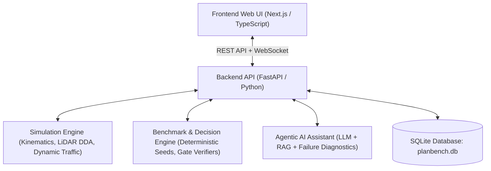

# Cẩm nang Hướng dẫn Sử dụng Toàn diện Agentic AI PlanBench
*(The Complete User & Developer Manual for Autonomous Mobile Robot Motion Planning Benchmark Platform)*

---

## 📑 Mục lục Toàn diện

1. [Tổng quan & Kiến trúc Nền tảng](#1-tổng-quan--kiến-trúc-nền-tảng)
2. [Cài đặt, Cấu hình Môi trường & Khởi chạy](#2-cài-đặt-cấu-hình-môi-trường--khởi-chạy)
   - [2.1. Cấu hình biến môi trường (`.env`)](#21-cấu-hình-biến-môi-trường-env)
   - [2.2. Khởi chạy toàn bộ hệ thống (WSL, Linux, macOS, Windows)](#22-khởi-chạy-toàn-bộ-hệ-thống-wsl-linux-macos-windows)
   - [2.3. Quản lý tài khoản & Đăng nhập OAuth](#23-quản-lý-tài-khoản--đăng-nhập-oauth)
3. [Hướng dẫn Chi tiết Từng Phân hệ Giao diện Web (14 Modules)](#3-hướng-dẫn-chi-tiết-từng-phân-hệ-giao-diện-web-14-modules)
   - [3.1. Trang Chủ & Bảng Tổng quan (`/`)](#31-trang-chủ--bảng-tổng-quan-)
   - [3.2. Quản lý & Trình vẽ Bản đồ (`/maps`)](#32-quản-lý--trình-vẽ-bản-đồ-maps)
   - [3.3. Quản lý Kịch bản Thử nghiệm (`/scenarios`)](#33-quản-lý-kịch-bản-thử-nghiệm-scenarios)
   - [3.4. Thiết lập Cấu hình Triển khai (`/deployments`)](#34-thiết-lập-cấu-hình-triển-khai-deployments)
   - [3.5. So sánh Thuật toán & Quyết định (`/decisions`)](#35-so-sánh-thuật-toán--quyết-định-decisions)
   - [3.6. Chạy Benchmark Hàng loạt (`/benchmarks`)](#36-chạy-benchmark-hàng-loạt-benchmarks)
   - [3.7. Trình Mô phỏng Trực quan Thời gian thực (`/simulate`)](#37-trình-mô-phỏng-trực-quan-thời-gian-thực-simulate)
   - [3.8. Bảng Xếp hạng Thuật toán Toàn diện (`/leaderboard`)](#38-bảng-xếp-hạng-thuật-toán-toàn-diện-leaderboard)
   - [3.9. Thư viện Kịch bản Chuẩn hóa (`/library`)](#39-thư-viện-kịch-bản-chuẩn-hóa-library)
   - [3.10. Quản lý Thuật toán & Cấu hình Điều khiển (`/algorithms` & `/candidates`)](#310-quản-lý-thuật-toán--cấu-hình-điều-khiển-algorithms--candidates)
   - [3.11. Hộp thư Duyệt kết quả Human-in-the-Loop (`/reviews`)](#311-hộp-thư-duyệt-kết-quả-human-in-the-loop-reviews)
   - [3.12. Trợ lý Trí tuệ Nhân tạo Agentic AI (`/agent`)](#312-trợ-lý-trí-tuệ-nhân-tạo-agentic-ai-agent)
   - [3.13. Chẩn đoán & Giám sát Hệ thống (`/system`)](#313-chẩn-đoán--giám-sát-hệ-thống-system)
   - [3.14. Xác thực & Hồ sơ Cá nhân (`/login`, `/welcome`, `/auth`)](#314-xác-thực--hồ-sơ-cá-nhân-login-welcome-auth)
4. [Bộ Công cụ Dòng lệnh CLI & Huấn luyện Nâng cao (Python Scripts)](#4-bộ-công-cụ-dòng-lệnh-cli--huấn-luyện-nâng-cao-python-scripts)
5. [Tích hợp Thuật toán Tùy chỉnh (Plugin SDK & ROS 2)](#5-tích-hợp-thuật-toán-tùy-chỉnh-plugin-sdk--ros-2)
6. [Bảng Giải nghĩa Cổng Kiểm soát Kỹ thuật (Gates G1–G6) & Chỉ số Đánh giá](#6-bảng-giải-nghĩa-cổng-kiểm-soát-kỹ-thuật-gates-g1g6--chỉ-số-đánh-giá)
7. [Giải đáp Thắc mắc & Xử lý Sự cố (FAQ & Troubleshooting)](#7-giải-đáp-thắc-mắc--xử-lý-sự-cố-faq--troubleshooting)

---

## 1. Tổng quan & Kiến trúc Nền tảng

**Agentic AI PlanBench** là nền tảng đo kiểm và ra quyết định chuyên biệt dành cho các thuật toán quy hoạch đường đi (*Global Path Planning*) và tránh vật cản động (*Local Motion Control*) của robot tự hành di động **AMR/AGV** trong môi trường kho bãi và nhà máy sản xuất.



### Các nguyên tắc cốt lõi:
1. **Chỉ mô phỏng — Không điều khiển robot phần cứng thật:** Tập trung tối đa vào độ chính xác của thuật toán và tính lặp lại (reproducibility), loại bỏ sự phụ thuộc vào Gazebo.
2. **Khóa điều kiện nghiêm ngặt (`conditions_checksum`):** Mọi thuật toán khi so tài đều nhận cùng một bản đồ, cùng vị trí xuất phát/đích, cùng chuỗi ngẫu nhiên (seed) của vật cản động và cùng mức nhiễu cảm biến LiDAR.
3. **Phê duyệt có con người kiểm soát (Human-in-the-loop):** AI đóng vai trò phân tích, tư vấn và phát hiện bất thường; con người giữ quyền quyết định phê duyệt và áp dụng thuật toán.

---

## 2. Cài đặt, Cấu hình Môi trường & Khởi chạy

### 2.1. Cấu hình biến môi trường (`.env`)
Dự án cung cấp file `.env.example`. Hãy tạo file `.env` tại thư mục gốc với các thông số chính:

```bash
# Cấu hình Cơ sở dữ liệu (để trống = in-memory, có đường dẫn = lưu vĩnh viễn)
PLANBENCH_DATABASE_URL=sqlite:///./planbench.db

# Cấu hình CORS
PLANBENCH_CORS_ORIGINS='["http://localhost:3000"]'

# Cấu hình OAuth (Google / GitHub)
GOOGLE_CLIENT_ID=your_google_client_id
GOOGLE_CLIENT_SECRET=your_google_client_secret
GITHUB_CLIENT_ID=your_github_client_id
GITHUB_CLIENT_SECRET=your_github_client_secret

# Cấu hình Trợ lý AI (Gemini / OpenAI / Anthropic)
PLANBENCH_AGENT_PROVIDER=gemini
GEMINI_API_KEY=your_gemini_api_key
```

### 2.2. Khởi chạy toàn bộ hệ thống
* **Khởi động trên WSL (Ubuntu) / Linux / macOS:**
  ```bash
  ./scripts/dev_stack.sh start
  ```
  * Web giao diện: `http://localhost:3000`
  * Tài liệu API tương tác: `http://localhost:8000/docs`
  * Xem log hệ thống: `./scripts/dev_stack.sh logs`
  * Dừng hệ thống: `./scripts/dev_stack.sh stop`
  * Khởi động lại: `./scripts/dev_stack.sh restart`

* **Khởi động riêng Backend trên Windows (PowerShell / cmd):**
  ```cmd
  .venv\Scripts\python.exe scripts\serve.py --reload --migrate
  ```

---

## 3. Hướng dẫn Chi tiết Từng Phân hệ Giao diện Web (14 Modules)

---

### 3.1. Trang Chủ & Bảng Tổng quan (`/`)
Bảng điều khiển trung tâm hiển thị tình trạng vận hành của toàn bộ hệ thống:
* **Workflow Banner (Quy trình 3 bước):** Hướng dẫn nhanh cho người mới bắt đầu: `1. Tạo bản đồ` $\rightarrow$ `2. Thiết lập Deployment` $\rightarrow$ `3. Chạy so sánh`.
* **Thẻ thống kê tổng hợp (Stat Cards):**
  * Số lượng bản đồ đã tạo (*Maps*).
  * Số lượng kịch bản (*Scenarios*).
  * Số lượt chạy benchmark (*Simulations*).
  * Số lần đưa ra quyết định so sánh (*Decisions*).
  * Hộp thư chờ duyệt (*Inbox reviews*).
* **Trạng thái kết nối API & Cơ sở dữ liệu:** Báo hiệu xanh (*Healthy*) nếu backend và database hoạt động đồng bộ.

---

### 3.2. Quản lý & Trình vẽ Bản đồ (`/maps`)
Bản đồ là lưới chiếm chỗ 2D (*Occupancy Grid*) xác định không gian di chuyển tự do và các vùng bị chiếm chỗ (tường, kệ hàng).

#### Các thao tác chính:
1. **Tạo bản đồ tự động:**
   * **Bản đồ kho mới (*New warehouse map*):** Tự động sinh lưới kho hàng chuẩn với các dãy kệ hàng song song và lối đi cho robot.
   * **Bản đồ trống mới (*New empty map*):** Tạo một khung sàn trống có tường bao quanh.
2. **Trình sửa bản đồ (Map Canvas Painter):**
   * **Chế độ Vẽ tường (*Occupied*):** Nhấp/kéo chuột để xây thêm vật cản.
   * **Chế độ Xóa tường (*Free*):** Nhấp/kéo chuột để mở rộng đường đi.
   * **Công cụ bổ trợ:** Đảo ngược bản đồ (*Invert*), Xóa sạch sàn (*Clear*), Thay đổi độ phân giải (*Resolution - mét/cell*).
3. **Chuyển tiếp luồng:** Bấm **`Thiết lập Deployment với bản đồ này →`** để dùng ngay bản đồ vừa vẽ cho bước tiếp theo.

---

### 3.3. Quản lý Kịch bản Thử nghiệm (`/scenarios`)
Kịch bản là sự kết hợp giữa **Bản đồ** + **Điểm xuất phát/đích** + **Vật cản động (Traffic)**.
* **Danh sách kịch bản:** Quản lý tất cả kịch bản đã tạo kèm thông số kích thước, số lượng vật cản động và mức độ phức tạp.
* **Xem trước kịch bản (Scenario Preview):** Xem vị trí xuất phát, đích đến và hướng di chuyển của vật cản động theo thời gian thực ($t$).
* **Xác thực hợp lệ:** Hệ thống kiểm tra xem điểm Start/Goal có bị cắm vào trong tường hay vật cản động có bị kẹt không.

---

### 3.4. Thiết lập Cấu hình Triển khai (`/deployments`)
Đây là trung tâm định nghĩa bài toán kỹ thuật chi tiết gồm 6 tab chức năng:

1. **Thông tin định danh (Identity):**
   * **ID:** Mã định danh duy nhất (ví dụ: `wh_aisle_speed_test`).
   * **Claim Level:** Mức cam kết chất lượng (`mission`, `deployment`, `robust_deployment`).
   * **Role:** Vai trò triển khai (`acceptance`, `customer`, `instrument`).
2. **Tab 1 — Nhiệm vụ (Mission):**
   * Chọn nguồn bản đồ (từ Thư viện hoặc Bản đồ lưu).
   * Bấm **`Set start`** $\rightarrow$ click lên bản đồ để đặt tọa độ $x, y$ và hướng $\theta$.
   * Bấm **`Set goal`** $\rightarrow$ click lên bản đồ để đặt đích đến $x, y, \theta$.
3. **Tab 2 — Động học Robot (Robot Kinematics):**
   * Bán kính robot $r$ (m), Vận tốc dài tối đa $v_{max}$ (m/s), Vận tốc góc tối đa $\omega_{max}$ (rad/s).
   * Gia tốc dài $a_{max}$ ($\text{m/s}^2$) và gia tốc góc $\alpha_{max}$ ($\text{rad/s}^2$).
   * Tải nhanh thông số từ các mẫu robot công nghiệp có sẵn (*Robot Profiles*).
4. **Tab 3 — Nhiễu Cảm biến (Sensor Noise):**
   * Nhiễu khoảng cách LiDAR $\sigma_{range}$, nhiễu góc LiDAR $\sigma_{bearing}$.
   * Tỷ lệ trượt bánh dài/ngang (*Wheel slip ratio*).
5. **Tab 4 — Giao thông Vật cản động (Traffic):**
   * Khai báo chướng ngại vật di chuyển cắt ngang hoặc tuần hoàn (tọa độ các điểm waypoint, chu kỳ lặp, bán kính).
6. **Tab 5 — Ngân sách Phần cứng (Hardware Budgets):**
   * Giới hạn dung lượng RAM dành cho thuật toán quy hoạch đường đi.
   * Chu kỳ tính toán điều khiển cho phép $T_{cycle}$ (mặc định $50\text{ ms}$).
7. **Tab 6 — Ràng buộc Nghiệm thu (Constraints):**
   * Tỷ lệ thành công tối thiểu `success_rate_min` (ví dụ: $95\%$).
   * Xác suất va chạm tối đa cho phép `collision_probability_max` (ví dụ: $1\%$).

> [!IMPORTANT]  
> **Nút "File it" (Nộp):** Sẽ sáng lên khi bạn đã điền đủ **ID**, chọn **Bản đồ**, và đặt điểm **Start & Goal** trên bản đồ.

---

### 3.5. So sánh Thuật toán & Quyết định (`/decisions`)
Nơi đưa 2 thuật toán ra so tài đối đầu trực tiếp để tìm ra giải pháp tối ưu cho Deployment:

1. **Khởi tạo trận đấu (Launch Comparison):**
   * **Deployment:** Chọn cấu hình bài toán vừa thiết lập.
   * **Candidate A:** Chọn cặp thuật toán (ví dụ: Global `astar` + Local `dwa_coarse`).
   * **Candidate B:** Chọn cặp đối trọng (ví dụ: Global `rrtstar` + Local `dwa_coarse`).
   * **Số Episodes ($N$):** Để trống để máy tự tính $N_{min}$ theo công thức toán học đảm bảo độ tin cậy thống kê, hoặc nhập số lượt tùy chọn.
   * Bấm **`Queue it`** để đưa vào hàng đợi chạy mô phỏng ngầm.
2. **Đọc kết quả so sánh:**
   * **Bảng kiểm định cổng (Gate Table G1–G6):** Báo hiệu từng thuật toán Đạt (*Pass*) hay Hỏng (*Fail*) ở từng tiêu chí.
   * **Thẻ quyết định (Decision Card):** Phân định rõ ràng thuật toán nào chiến thắng kèm độ chênh lệch độ thỏa dụng $\Delta U$.

---

### 3.6. Chạy Benchmark Hàng loạt (`/benchmarks`)
Phân hệ chạy đo kiểm quy mô lớn trên nhiều thuật toán và nhiều kịch bản cùng lúc:
* **Tạo Benchmark mới:** Chọn tập hợp kịch bản và danh sách các thuật toán ứng viên.
* **Tiến độ từng Episode:** Hiển thị thanh tiến trình trực tiếp qua WebSocket.
* **Báo cáo Thống kê:** Tổng hợp các chỉ số trung vị (*Median*), khoảng tứ phân vị (*IQR*), khoảng tin cậy Bootstrap 95%, và kiểm định ý nghĩa thống kê Wilcoxon.
* **Xuất báo cáo:** Tải về file báo cáo đầy đủ định dạng **Markdown Report**.

---

### 3.7. Trình Mô phỏng Trực quan Thời gian thực (`/simulate`)
Công cụ trực quan hóa sống động chuyển động của robot:
* **Chế độ hiển thị 2D Canvas:**
  * Thể hiện thân xe robot di chuyển theo phương trình động học vi sai (*Differential drive*).
  * Tia quét cảm biến LiDAR 360 độ (dùng thuật toán DDA raycasting) phản xạ theo thời gian thực khi chạm tường.
  * Vùng an toàn phồng (*Inflation layer*) và vệt quỹ đạo đã đi qua (*Trajectory trace*).
* **Chế độ hiển thị 2.5D Isometric:**
  * Góc nhìn phối cảnh 2.5D tạo cảm giác không gian 3 chiều trực quan cho nhà xưởng.
* **Bảng điều khiển phát lại:** Tạm dừng, tua từng bước (*Step-by-step*), điều chỉnh tốc độ từ $0.5\times$ đến $5\times$.

---

### 3.8. Bảng Xếp hạng Thuật toán Toàn diện (`/leaderboard`)
Bảng tổng sắp hiệu năng của tất cả các thuật toán đã tham gia benchmark trong hệ thống:
* Xếp hạng theo **Tỷ lệ thành công (Success Rate)**.
* Xếp hạng theo **Thời gian hoàn thành trung bình (Time-to-goal)**.
* Xếp hạng theo **Độ mượt mà và khoảng cách an toàn (Smoothness & Clearance)**.
* Xếp hạng theo **Độ trễ tính toán (P95 Latency)**.

---

### 3.9. Thư viện Kịch bản Chuẩn hóa (`/library`)
Kho lưu trữ 10 kịch bản thử nghiệm mẫu được thiết kế sẵn:
1. `empty_hall`: Phòng trống lớn, kiểm tra tốc độ tối đa và bám quỹ đạo thẳng.
2. `narrow_door`: Cửa hẹp, thử thách khả năng căn chỉnh thân xe qua khe hẹp.
3. `sudden_stop`: Vật cản động lao ra bất ngờ cắt ngang đường di chuyển.
4. `hallway_crossing`: Hai vật cản động di chuyển đan xen qua ngã tư hành lang.
5. `warehouse_a`: Kho hàng tiêu chuẩn 4 dãy kệ song song.
6. `warehouse_b`: Kho hàng quy mô lớn với nhiều góc khuất và điểm giao cắt.
7. `maze_simple`: Mê cung đơn giản kiểm tra khả năng thoát khỏi bẫy cục bộ.
8. `dynamic_clutter`: Môi trường đông đúc với nhiều vật cản di chuyển ngẫu nhiên.
9. `u_trap`: Bẫy hình chữ U, kiểm tra hiện tượng mắc kẹt của thuật toán thế năng / DWA.
10. `diagonal_pillars`: Hàng cột so le chéo, kiểm tra khả năng lách khúc cua liên tục.

---

### 3.10. Quản lý Thuật toán & Cấu hình Điều khiển (`/algorithms` & `/candidates`)
* Quản lý các cấu hình **Global Planners** (A\*, RRT\*).
* Quản lý các cấu hình **Local Controllers** (DWA mịn, DWA thô, Pure Pursuit, PPO Neural Policy).
* Khai báo dải vận tốc, thời gian dự đoán chân trời (*Time Horizon*), và các trọng số hàm mục tiêu (*Heading weight, Obstacle clearance weight, Velocity weight*).

---

### 3.11. Hộp thư Duyệt kết quả Human-in-the-Loop (`/reviews`)
Quy trình đảm bảo tính minh bạch trước khi đưa cấu hình vào nhà máy:
* **Hộp thư đến (Inbox):** Xem các kết quả Decision Run được gửi đến yêu cầu bạn phê duyệt.
* **Giao diện Soi chi tiết:** Xem lại toàn bộ bảng Gate Table, vết chạy lỗi của từng episode thất bại.
* **Hành động duyệt:**
  * **Approved:** Phê chuẩn thuật toán chiến thắng.
  * **Changes Requested:** Gửi lại phản hồi yêu cầu tinh chỉnh tham số hoặc tăng số lượng episodes thử nghiệm.

---

### 3.12. Trợ lý Trí tuệ Nhân tạo Agentic AI (`/agent`)
Trợ lý AI tích hợp sẵn trong nền tảng (sử dụng Google Gemini, OpenAI hoặc Claude):
* **Hỏi đáp & Tra cứu:** Giải thích các khái niệm toán học, ý nghĩa các chỉ số $T_{cycle}$, Pareto $\Delta U$.
* **Chẩn đoán nguyên nhân thất bại (Failure Root-Cause Diagnosis):**
  * Tự động đọc log của các lần chạy va chạm và phân tích nguyên nhân (ví dụ: *Do vận tốc góc $\omega$ quá lớn dẫn đến hiện tượng trượt bánh khi bo cua hẹp*).
* **Tư vấn Tinh chỉnh Siêu tham số:** Gợi ý dải tham số DWA phù hợp với kích thước robot cụ thể.
* **Tự động sinh kịch bản:** Nhập yêu cầu bằng văn bản tự nhiên để AI tạo ra cấu hình Deployment hoàn chỉnh.

---

### 3.13. Chẩn đoán & Giám sát Hệ thống (`/system`)
* Kiểm tra tình trạng kết nối giữa Frontend và FastAPI Backend.
* Giám sát tình trạng Cơ sở dữ liệu SQLite (`planbench.db`) và các phiên bản Migration của Alembic.
* Kiểm tra cấu hình MLflow tracking server và trạng thái các tiến trình nền.

---

### 3.14. Xác thực & Hồ sơ Cá nhân (`/login`, `/welcome`, `/auth`)
* Hỗ trợ đăng nhập linh hoạt qua Google OAuth, GitHub OAuth hoặc Chế độ khách (Developer guest).
* Trang đón tiếp (`/welcome`) hướng dẫn người dùng thiết lập Nickname và định danh tác giả trên hệ thống.

---

## 4. Bộ Công cụ Dòng lệnh CLI & Huấn luyện Nâng cao (Python Scripts)

Ngoài giao diện web, các nhà nghiên cứu có thể sử dụng trực tiếp các script Python trong thư mục `scripts/`:

```bash
# 1. Chạy đo đạc benchmark nhanh cho 1 kịch bản từ terminal:
python scripts/measure.py --scenario warehouse_a --algorithm astar+dwa --episodes 20

# 2. So sánh trực tiếp 2 thuật toán từ dòng lệnh:
python scripts/compare.py --profile profiles/warehouse_a.yaml --first astar+dwa --second rrtstar+dwa

# 3. Đo đạc độ khó định lượng của bản đồ:
python scripts/calibrate_difficulty.py --map maps/warehouse_a.json

# 4. Huấn luyện thuật toán học tăng cường PPO (Gymnasium environment):
python scripts/train_ppo.py --total-timesteps 100000

# 5. Tự động tinh chỉnh siêu tham số bằng Optuna:
python scripts/tune_hyperparameters.py --study-name dwa_optimization --n-trials 50

# 6. Chẩn đoán các hiện tượng lỗi đặc biệt:
python scripts/diagnose_phantom.py      # Kiểm tra lỗi vật cản ảo
python scripts/diagnose_oracle.py       # Kiểm tra sai lệch cảm biến
python scripts/diagnose_resolution.py   # Kiểm tra ảnh hưởng của độ phân giải lưới
```

---

## 5. Tích hợp Thuật toán Tùy chỉnh (Plugin SDK & ROS 2)

Bạn hoàn toàn có thể đưa thuật toán tự phát triển vào PlanBench để đánh giá:

### 1. Kế thừa lớp BasePlanner trong Python:
```python
from planbench_planning.base import GlobalPlanner, PlanResult

class MyCustomPlanner(GlobalPlanner):
    def plan(self, grid, start, goal) -> PlanResult:
        # Triển khai thuật toán của bạn tại đây (ví dụ: Theta*, Dijkstra, Hybrid A*)
        path = self._my_algorithm(grid, start, goal)
        return PlanResult(success=True, path=path, computation_time_ms=12.5)
```

### 2. Tích hợp qua ROS 2 (Nav2):
Hệ thống cung cấp bridge closed-loop trong thư mục `ros2_ws/` cho phép kết nối trực tiếp với các planner node của ROS 2 qua topic `/plan` và `/cmd_vel`.

---

## 6. Bảng Giải nghĩa Cổng Kiểm soát Kỹ thuật (Gates G1–G6) & Chỉ số Đánh giá

| Cổng | Tên cổng | Ý nghĩa kỹ thuật | Tiêu chuẩn Đạt |
|:---:|---|---|---|
| **G1** | **Khả thi động học** *(Kinematic Feasibility)* | Đảm bảo quỹ đạo tuân thủ mô hình động học vi sai, không vi phạm giới hạn $v_{max}, \omega_{max}, a_{max}$. | $100\%$ các bước di chuyển không vượt ngưỡng. |
| **G2** | **Khoảng cách an toàn** *(Obstacle Clearance)* | Robot luôn duy trì một khoảng cách đệm an toàn với các chướng ngại vật tĩnh và động. | Không xâm phạm vùng biên phồng an toàn tối thiểu. |
| **G3** | **Tỷ lệ về đích** *(Success Rate)* | Tỷ lệ số lần robot hoàn thành nhiệm vụ đến đúng đích trong thời gian cho phép. | $\ge \text{success\_rate\_min}$ (mặc định $95\%$). |
| **G4** | **Ngân sách thời gian** *(Cycle Latency Budget)* | Thuật toán phải đưa ra quyết định kịp thời trong từng chu kỳ điều khiển của bo mạch nhúng. | Độ trễ phân vị $P95 \le T_{cycle}$ (mặc định $50\text{ ms}$). |
| **G5** | **Rủi ro va chạm** *(Collision Probability)* | Tần suất va chạm thực nghiệm qua $N$ lần lặp lại độc lập. | $\le \text{collision\_probability\_max}$ (mặc định $1\%$). |
| **G6** | **Độ mượt mà** *(Motion Smoothness)* | Đo lường độ biến thiên gia tốc (*Jerk*) và số lần dừng giật cục (*Stop-and-go count*). | Điểm số mượt mà nằm trong dải chấp nhận. |

---

## 7. Giải đáp Thắc mắc & Xử lý Sự cố (FAQ & Troubleshooting)

### ❓ 1. Nút "File it" ở trang Deployments bị mờ không bấm được?
👉 **Nguyên nhân & Khắc phục:** Bạn cần hoàn thành đủ 4 thông tin tối thiểu:
1. Đã nhập **ID** ở hàng trên cùng.
2. Đã chọn **Bản đồ** từ Library hoặc Stored maps.
3. Đã bấm nút **Set start** và click vào sàn trống trên bản đồ.
4. Đã bấm nút **Set goal** và click vào sàn trống trên bản đồ.

### ❓ 2. Làm sao để khởi động lại sạch sẽ toàn bộ hệ thống trên WSL?
👉 **Khắc phục:** Chạy lệnh sau trong terminal:
```bash
cd ~/T011-rav19-planbench && bash scripts/dev_stack.sh restart
```

### ❓ 3. Dữ liệu bản đồ, benchmark và tài khoản được lưu ở đâu?
👉 Dữ liệu được lưu trong cơ sở dữ liệu SQLite tại file **`planbench.db`** ở thư mục gốc repo. Dữ liệu này được giữ nguyên qua các lần tắt mở máy.

### ❓ 4. Tại sao số lượng AI Log trên hệ thống chấm điểm tăng lên?
👉 Mọi prompt tương tác của bạn với trợ lý AI sẽ tự động được ghi nhận và gửi lên máy chủ lưu vết `AI_LOG_SERVER` mỗi khi bạn thực hiện lệnh `git push` hoặc qua script `scripts/submit_log.py`.

---
*Tài liệu hướng dẫn sử dụng chính thức của Dự án Agentic AI PlanBench.*
