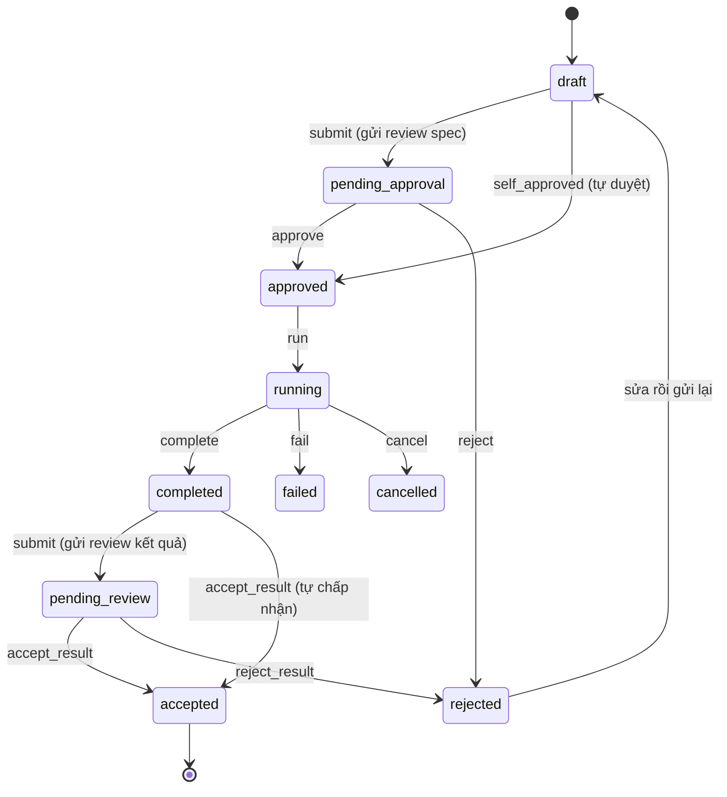
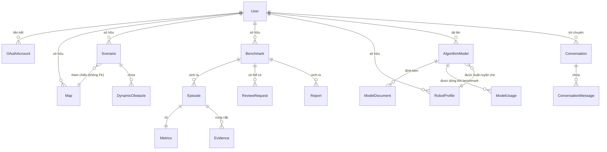
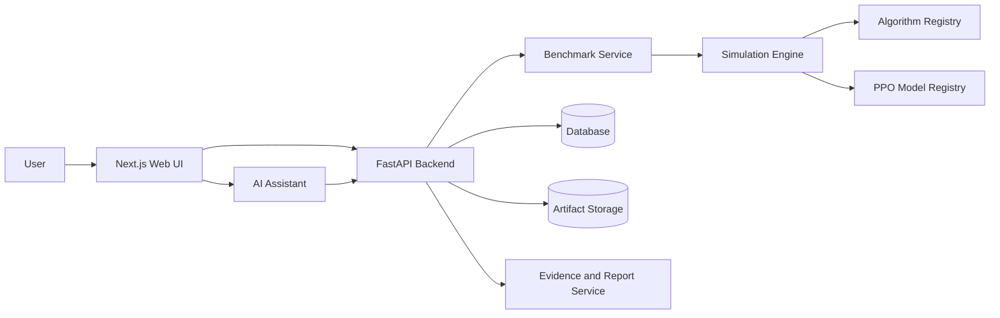

# Product Requirements Document – RAV19 PlanBench

> Deliverable 2/4 – [Gate G1](./README.md)

## Mục lục

- [1. Thông tin tài liệu](#1-thông-tin-tài-liệu)
- [2. Tổng quan sản phẩm](#2-tổng-quan-sản-phẩm)
- [3. Problem statement](#3-problem-statement)
- [4. Product vision](#4-product-vision)
- [5. Mục tiêu](#5-mục-tiêu)
- [6. Non-goals](#6-non-goals)
- [7. Người dùng mục tiêu](#7-người-dùng-mục-tiêu)
- [8. Personas](#8-personas)
- [9. User stories](#9-user-stories)
- [10. Phạm vi chức năng (MoSCoW)](#10-phạm-vi-chức-năng-moscow)
- [11. Functional requirements](#11-functional-requirements)
- [12. Authentication và tài khoản](#12-authentication-và-tài-khoản)
- [13. Map và Scenario](#13-map-và-scenario)
- [14. Live Simulation](#14-live-simulation)
- [15. Thuật toán và simulator](#15-thuật-toán-và-simulator)
- [16. Benchmark](#16-benchmark)
- [17. Metrics](#17-metrics)
- [18. PPO Model Registry và Robot Profile](#18-ppo-model-registry-và-robot-profile)
- [19. AI Chatbot](#19-ai-chatbot)
- [20. Evidence và report](#20-evidence-và-report)
- [21. Review workflow](#21-review-workflow)
- [22. Leaderboard](#22-leaderboard)
- [23. UX requirements](#23-ux-requirements)
- [24. Non-functional requirements](#24-non-functional-requirements)
- [25. Data model overview](#25-data-model-overview)
- [26. System architecture](#26-system-architecture)
- [27. API overview](#27-api-overview)
- [28. Safety và Human-in-the-loop](#28-safety-và-human-in-the-loop)
- [29. Risks và mitigations](#29-risks-và-mitigations)
- [30. Acceptance criteria](#30-acceptance-criteria)
- [31. Feature status](#31-feature-status)
- [32. Roadmap](#32-roadmap)

---

## 1. Thông tin tài liệu

| Mục | Nội dung |
|---|---|
| Tên sản phẩm | RAV19 – PlanBench (Agentic AI PlanBench) |
| Phiên bản tài liệu | 1.0 |
| Trạng thái | Draft for Gate G1 |
| Ngày cập nhật | 2026-08-02 |
| Chủ sở hữu tài liệu | `[CẦN ĐIỀN: Tên nhóm]` |
| Người duyệt | `[CẦN ĐIỀN: Người duyệt]` |
| Ngày ký | `[CẦN ĐIỀN: Ngày ký]` |
| Phạm vi | Gate G1 – chốt đề tài: bài toán, người dùng, phạm vi MVP, yêu cầu chức năng, kiến trúc tổng thể |

Trạng thái hiện tại của mã nguồn: [§31 Feature status](#31-feature-status).

---

## 2. Tổng quan sản phẩm

PlanBench là nền tảng web chỉ mô phỏng dùng để **thiết lập, thực thi và
đánh giá** các thuật toán điều hướng cho robot AMR/AGV. Người dùng dựng
bản đồ và kịch bản, chọn một hoặc nhiều *stack* thuật toán (một global
planner ghép với một local planner), chạy chúng trên cùng một tập seed
trong điều kiện bị khóa, rồi xem metrics, phát lại quỹ đạo và chẩn đoán
những lượt thất bại.

Ba tính chất được coi trọng ngang nhau: **tính công bằng** (điều kiện
được băm thành checksum để biết hai benchmark có so sánh được không),
**khả năng tái lập** (seed tường minh, không có trạng thái ngẫu nhiên
toàn cục), và **khả năng giải thích** (trợ lý AI đọc kết quả đã lưu và
diễn giải, kèm evidence trỏ về bản ghi thật).

---

## 3. Problem statement

| Vấn đề | Biểu hiện cụ thể |
|---|---|
| Thiếu môi trường chuẩn | Mỗi người tự dựng map, tự chọn timeout; hai kết quả không đặt cạnh nhau được |
| So sánh thiếu công bằng | Khác seed, khác map, khác tham số robot — chênh lệch đo được không quy về thuật toán |
| Khó tái hiện lỗi | Robot kẹt một lần rồi thôi vì trạng thái ngẫu nhiên không được ghi |
| Thiếu công cụ quan sát | Biết tỉ lệ thất bại nhưng không xem được nó hỏng ở bước nào |
| Kết quả khó hiểu | `min_clearance = 0.04 m` không tự nói lên điều gì với người mới |
| Tích hợp PPO thủ công | Phải sửa đường dẫn file trong code; không có gì bảo đảm kết quả sinh ra bởi đúng checkpoint nào |
| Chi phí thiết lập cao | Dựng một thử nghiệm tử tế mất hàng giờ trước khi có con số đầu tiên |

---

## 4. Product vision

> Cho phép người dùng **thiết lập, chạy, so sánh và hiểu** benchmark
> robot thông qua giao diện web và trợ lý AI — trong đó máy làm phần
> lặp lại, còn con người giữ quyền quyết định.

---

## 5. Mục tiêu

| # | Mục tiêu | Đo bằng gì |
|---|---|---|
| G1 | Chuẩn hóa benchmark | Mọi stack trong một benchmark dùng chung map, scenario, seed, robot profile; điều kiện được băm thành `conditions_checksum` |
| G2 | Tăng khả năng tái lập | Chạy lại cùng spec cho cùng kết quả |
| G3 | Giảm thời gian thiết lập | Import scenario dựng sẵn và chạy được trong vài thao tác, không cần viết code |
| G4 | Hỗ trợ cả classic và RL | A\*+DWA và A\*+PPO là hai stack cùng hạng, so sánh trực tiếp được |
| G5 | Giải thích dễ hiểu | Trợ lý diễn giải kết quả đã lưu, kèm evidence |
| G6 | Giữ Human-in-the-loop | Không hành động quan trọng nào xảy ra mà không có người bấm |
| G7 | Quản lý model qua web | Tải PPO lên và chọn theo ID, không sửa đường dẫn trong code |

---

## 6. Non-goals

Những điều PlanBench **không** làm:

- **Không điều khiển robot thật.** Không kết nối phần cứng, không phát
  lệnh vận tốc ra thiết bị.
- **Không cấp chứng nhận an toàn.** Kết quả mô phỏng không phải bằng
  chứng an toàn vận hành.
- **Không thay thế kỹ sư robotics.**
- **Không huấn luyện mọi loại robot trong MVP.** Hiện chỉ nhận model đã
  huấn luyện sẵn.
- **Không coi PDF là model PPO.** File `.pdf` là tài liệu; chỉ `.zip`
  của Stable-Baselines3 mới chạy được như một policy.
- **Không cho AI tự quyết định kết quả.** AI không tạo, sửa, chấp nhận
  hay từ chối bất cứ kết quả nào.
- **Không tuyên bố production-ready.** Xem
  [KNOWN_LIMITATIONS.md](../KNOWN_LIMITATIONS.md).

---

## 7. Người dùng mục tiêu

| Nhóm | Nhu cầu chính | Mức kỹ thuật |
|---|---|---|
| Sinh viên robotics | Có số liệu so sánh cho đồ án, hiểu vì sao thuật toán thất bại | Trung bình |
| Nhóm nghiên cứu | Kết quả tái lập được, xuất báo cáo có dẫn chứng | Cao |
| Kỹ sư AMR/AGV | Chọn stack cho một môi trường triển khai cụ thể | Cao |
| Người phát triển thuật toán | Baseline để đối chiếu thuật toán mới | Rất cao |
| Người đánh giá model RL | Đánh giá checkpoint PPO mà không phải đọc code nền tảng | Trung bình – cao |

---

## 8. Personas

### Persona 1 — Minh, sinh viên năm cuối robotics

- **Mục tiêu:** so sánh A\*+DWA với một chính sách PPO trong đồ án tốt
  nghiệp, và giải thích được vì sao cái này thắng cái kia.
- **Khó khăn:** chưa từng dựng môi trường benchmark; mỗi lần chạy lại
  ra số khác nhau và không biết vì sao.
- **Nhu cầu:** scenario dựng sẵn, chạy được ngay, xem lại được quỹ đạo,
  và một lời giải thích bằng tiếng người cho các con số.
- **Mức kỹ thuật:** biết Python, chưa quen thuật ngữ planning.

### Persona 2 — Hà, kỹ sư điều hướng AMR

- **Mục tiêu:** chọn cấu hình local planner cho một nhà kho có hành lang
  hẹp và người đi lại.
- **Khó khăn:** cần bằng chứng đủ chắc để bảo vệ trước nhóm kỹ thuật;
  "chạy thử thấy ổn" không đủ.
- **Nhu cầu:** chạy nhiều seed, biết chắc điều kiện giống hệt nhau, xem
  được từng lượt thất bại, và xuất báo cáo có dẫn chứng.
- **Mức kỹ thuật:** cao; đọc được metrics thô và muốn thấy chúng.

### Persona 3 — Tuấn, người đánh giá model PPO

- **Mục tiêu:** đánh giá các checkpoint do nhóm ML huấn luyện, không
  phải người viết ra chúng.
- **Khó khăn:** không biết checkpoint được huấn luyện với bố cục quan
  sát nào; sửa đường dẫn trong code là việc của người khác.
- **Nhu cầu:** tải `.zip` lên qua web, được cảnh báo khi model không
  khớp robot profile, và biết chắc kết quả gắn với đúng file nào.
- **Mức kỹ thuật:** trung bình – cao về ML, thấp về nền tảng này.

---

## 9. User stories

Ký hiệu: **US-xx**. Acceptance criteria viết theo Given/When/Then.

### US-01 — Đăng nhập

> **As a** người dùng mới, **I want** đăng nhập bằng tài khoản Google
> hoặc GitHub sẵn có, **so that** tôi không phải tạo thêm mật khẩu.

- **Given** tôi chưa đăng nhập, **when** tôi mở PlanBench, **then** tôi
  thấy trang đăng nhập với các provider đã được cấu hình.
- **Given** provider chưa được cấu hình, **when** tôi mở trang đăng
  nhập, **then** nút của provider đó không hiện, thay vì hiện rồi lỗi.
- **Given** tôi đăng nhập thành công, **then** phiên làm việc được giữ,
  và **không có** access token hay secret nào nằm trong `localStorage`.

### US-02 — Chọn nickname

> **As a** người dùng vừa đăng nhập lần đầu, **I want** chọn một
> nickname, **so that** người khác gửi review cho tôi mà không cần biết
> email của tôi.

- **Given** tôi chưa có nickname, **when** đăng nhập xong, **then** tôi
  được đưa tới trang chọn nickname.
- **Given** nickname đã có người dùng, **when** tôi gửi, **then** tôi
  nhận thông báo rõ ràng và được chọn lại.
- **Given** tôi đã có nickname, **then** phân quyền vẫn dựa trên **user
  ID**, không dựa trên nickname.

### US-03 — Tạo map

> **As a** người dùng, **I want** vẽ hoặc chỉnh sửa bản đồ, **so that**
> tôi mô phỏng đúng môi trường mình quan tâm.

- **Given** tôi ở Map Editor, **when** tôi vẽ tường và lưu, **then** map
  được tạo với kích thước, resolution và checksum.
- **Given** map có origin xoay (`theta ≠ 0`), **when** lưu, **then** hệ
  thống từ chối và nói rõ lý do (chưa hỗ trợ).

### US-04 — Import scenario

> **As a** người dùng mới, **I want** import một scenario dựng sẵn,
> **so that** tôi chạy thử ngay mà không phải tự dựng.

- **Given** tôi ở Scenario Library, **when** tôi xem trước và bấm
  Import, **then** một map và một scenario được tạo cho tài khoản tôi.
- **Given** import xong, **then** tôi có lối tắt sang Live Simulation
  hoặc Create Benchmark.

### US-05 — Chạy live simulation

> **As a** người dùng, **I want** chạy thử một lượt và xem robot di
> chuyển, **so that** tôi kiểm tra cấu hình trước khi benchmark.

- **Given** đã chọn map, scenario, thuật toán, **when** tôi bấm Run,
  **then** tôi thấy đường đi toàn cục và quỹ đạo thực tế cập nhật theo
  thời gian thực.
- **Given** đang chạy, **then** tôi dừng, tiếp tục, đặt lại và đổi tốc
  độ phát được.
- **Given** lượt chạy kết thúc, **then** trạng thái kết thúc hiện rõ
  (success / collision / timeout / stuck / no_global_path).

### US-06 — Tạo benchmark thủ công

> **As a** người dùng có kinh nghiệm, **I want** điền form benchmark,
> **so that** tôi kiểm soát chính xác từng tham số.

- **Given** tôi điền tên, map, scenario, seeds, stacks, **when** bấm
  Create, **then** một benchmark ở trạng thái `draft` được tạo.
- **Given** cấu hình không hợp lệ, **then** tôi nhận thông báo bằng
  tiếng người, **không** phải lỗi validate thô của thư viện.

### US-07 — Tạo benchmark qua AI

> **As a** người dùng chưa quen thuật ngữ, **I want** mô tả nhu cầu
> bằng lời, **so that** trợ lý giúp tôi dựng cấu hình đúng.

- **Given** tôi mô tả "so sánh DWA và PPO ở cửa hẹp", **when** trợ lý
  trả lời, **then** tôi thấy một **thẻ đề xuất** nêu scenario, stacks,
  seeds và các giả định.
- **Given** thẻ đề xuất hiện ra, **then** **chưa có gì được tạo**.
- **Given** tôi bấm "Tạo bản nháp", **then** backend kiểm tra dữ liệu và
  tạo benchmark ở trạng thái `draft`.
- **Given** bản nháp đã tạo, **then** **trợ lý không chạy nó**; tôi phải
  tự mở và bấm Run.

### US-08 — Chạy nhiều seed

> **As a** người đánh giá, **I want** chạy cùng cấu hình trên nhiều
> seed, **so that** kết luận không dựa vào một lần may mắn.

- **Given** benchmark có N seed và M stack, **when** chạy, **then** hệ
  thống thực thi N×M episode và tổng hợp theo stack.
- **Given** đang chạy, **then** tôi thấy tiến độ và dừng được.

### US-09 — Xem replay

> **As a** người dùng, **I want** phát lại một episode, **so that** tôi
> thấy robot đã đi thế nào.

- **Given** một episode đã hoàn tất, **when** tôi mở replay, **then**
  quỹ đạo được dựng lại từ artifact đã lưu, không phải chạy lại.

### US-10 — Chẩn đoán lỗi

> **As a** người dùng, **I want** biết vì sao một episode thất bại,
> **so that** tôi sửa được cấu hình hoặc hiểu giới hạn thuật toán.

- **Given** một episode có trạng thái collision/stuck/timeout, **when**
  tôi mở Diagnose, **then** tôi thấy các phát hiện cụ thể (vị trí, thời
  điểm, khoảng cách tới vật cản) chứ không chỉ một nhãn.

### US-11 — So sánh thuật toán

> **As a** người dùng, **I want** đặt các stack cạnh nhau, **so that**
> tôi thấy cái nào tốt hơn ở tiêu chí nào.

- **Given** một benchmark nhiều stack, **then** bảng tổng hợp hiện
  metrics theo từng stack trên cùng một tập seed.
- **Given** hai benchmark khác điều kiện, **then** hệ thống **không**
  đặt chúng cạnh nhau như thể so sánh được.

### US-12 — Tải model PPO

> **As a** người đánh giá model, **I want** tải `.zip` lên qua web,
> **so that** tôi không phải sửa đường dẫn trong code.

- **Given** tôi chọn một `.zip` của Stable-Baselines3, **when** tải lên,
  **then** tôi thấy tiến độ, kích thước, và trạng thái kiểm tra.
- **Given** tôi chọn `.py`, `.sh`, hoặc `.pdf` ở ô model, **then** hệ
  thống từ chối và giải thích rằng PDF là tài liệu, không chạy được.
- **Given** file vượt giới hạn kích thước, **then** upload bị dừng
  **giữa chừng** kèm thông báo, không phải nhận hết rồi mới từ chối.
- **Given** upload thành công, **then** **không** đường dẫn nội bộ nào
  hiện ra cho tôi.

### US-13 — Chọn Robot Profile

> **As a** người dùng, **I want** khai báo tham số robot một lần,
> **so that** model và benchmark dùng chung một định nghĩa.

- **Given** tôi tạo profile với bán kính và giới hạn vận tốc, **then**
  tôi chọn được nó khi tải model và khi tạo benchmark.
- **Given** model được huấn luyện với 24 tia LiDAR nhưng profile khai
  32, **then** báo cáo tương thích nêu **cả hai con số**.

### US-14 — Xem Leaderboard

> **As a** người dùng, **I want** xem bảng xếp hạng, **so that** tôi
> biết stack nào đang dẫn đầu.

- **Given** các benchmark đã được chấp nhận, **then** leaderboard chỉ
  xếp chung những kết quả có điều kiện tương thích.

### US-15 — Tự chấp nhận kết quả

> **As a** chủ sở hữu benchmark, **I want** tự chấp nhận kết quả của
> mình, **so that** tôi không bị chặn khi làm việc một mình.

- **Given** tôi là chủ sở hữu và không gửi review cho ai, **when** tôi
  chấp nhận, **then** audit log ghi rõ đây là **self-approve**, không
  phải "người thứ hai đã duyệt".

### US-16 — Gửi review bằng nickname

> **As a** người dùng, **I want** nhờ đồng nghiệp xem lại, **so that**
> kết quả có người thứ hai kiểm chứng.

- **Given** tôi nhập nickname người nhận, **when** gửi, **then** yêu
  cầu xuất hiện ở hộp thư của họ.
- **Given** người nhận là tôi, **then** hệ thống từ chối tự-review.
- **Given** reviewer approve/reject/comment, **then** mọi hành động vào
  audit log kèm thời điểm và người thực hiện.

### US-17 — Hỏi AI giải thích kết quả

> **As a** người dùng, **I want** hỏi trợ lý về kết quả, **so that** tôi
> hiểu các con số nói gì.

- **Given** một benchmark đã hoàn tất, **when** tôi hỏi, **then** trợ lý
  trả lời dựa trên **kết quả đã lưu**, và số trong câu trả lời khớp với
  số trong report.
- **Given** dữ liệu không tồn tại, **then** trợ lý nói không có, không
  bịa.

### US-18 — Sinh báo cáo có evidence

> **As a** người dùng, **I want** một báo cáo có dẫn chứng, **so that**
> tôi trình bày được cho người khác.

- **Given** báo cáo được sinh, **then** mọi khẳng định có citation trỏ
  về một bản ghi có thật.
- **Given** một citation trỏ vào thứ không tồn tại, **then** báo cáo bị
  loại thay vì được phát hành kèm dẫn chứng sai.

---

## 10. Phạm vi chức năng (MoSCoW)

### Must have

- Đăng nhập OAuth (Google/GitHub) + nickname.
- Map: tạo, sửa, lưu, checksum.
- Scenario Library + import.
- Live Simulation + playback.
- Stack A\* + DWA.
- Benchmark nhiều seed, nhiều stack, điều kiện khóa + `conditions_checksum`.
- Metrics và tổng hợp theo stack.
- Episode replay từ artifact.
- Trợ lý: đề xuất cấu hình → người dùng xác nhận → bản nháp.
- Trợ lý: giải thích kết quả đã lưu.
- Chấp nhận kết quả (tự chấp nhận hoặc gửi review).

### Should have

- PPO Model Registry: upload, kiểm tra tương thích, chọn theo ID.
- Robot Profile.
- Failure analysis chi tiết.
- Leaderboard.
- Report có evidence và citation được kiểm tra.
- Review workflow tùy chọn với nickname.
- VI/EN, Light/Dark/System, responsive.

### Could have

- Hiển thị 2.5D.
- MLflow tracking cho huấn luyện.
- Trang System Information cho chẩn đoán kỹ thuật.
- Lịch sử hội thoại với trợ lý (liệt kê, mở lại).

### Future

- Huấn luyện PPO ngay trên nền tảng (job thật, tiến độ thật).
- ROS2/Nav2 tích hợp vào giao diện web.
- Object storage (S3/R2) cho model và artifact.
- Sandbox container có quota khi nạp model người dùng tải lên.
- Nhiều loại robot ngoài differential drive.

---

## 11. Functional requirements

Mỗi requirement gồm: mô tả, actor, input, processing, output,
validation, error state, priority.

### FR-AUTH-01 — Đăng nhập bằng OAuth

- **Mô tả:** người dùng đăng nhập bằng Google hoặc GitHub.
- **Actor:** khách chưa đăng nhập.
- **Input:** lựa chọn provider; mã ủy quyền do provider trả về.
- **Processing:** trao đổi mã lấy hồ sơ ở **phía server**; chỉ chấp nhận
  email đã được provider xác minh; tạo hoặc tra cứu tài khoản; cấp phiên.
- **Output:** phiên đăng nhập; chuyển hướng tới nickname hoặc Dashboard.
- **Validation:** email chưa xác minh bị từ chối; hai tài khoản **không**
  tự động gộp chỉ vì trùng email.
- **Error state:** "Không đăng nhập được bằng {provider}. Hãy thử lại
  hoặc dùng cách khác."
- **Priority:** Must

### FR-AUTH-02 — Nickname

- **Mô tả:** mỗi tài khoản chọn một nickname duy nhất.
- **Actor:** người dùng đã đăng nhập, chưa có nickname.
- **Input:** chuỗi nickname.
- **Processing:** kiểm tra định dạng và tính duy nhất; lưu.
- **Output:** nickname gắn với tài khoản.
- **Validation:** trùng thì từ chối; **phân quyền luôn dựa trên user ID**,
  không dựa trên nickname.
- **Error state:** "Nickname này đã có người dùng. Hãy chọn tên khác."
- **Priority:** Must

### FR-MAP-01 — Tạo và lưu map

- **Mô tả:** dựng lưới chiếm dụng mô tả môi trường.
- **Actor:** người dùng đã đăng nhập.
- **Input:** width, height, resolution, origin, mảng ô.
- **Processing:** validate theo schema; tính checksum; lưu.
- **Output:** bản ghi map có id và checksum.
- **Validation:** giá trị ô theo quy ước ROS (FREE=0, OCCUPIED=100,
  UNKNOWN=−1); `origin.theta` phải bằng 0.
- **Error state:** "Bản đồ có gốc tọa độ xoay chưa được hỗ trợ."
- **Priority:** Must

### FR-SCENARIO-01 — Scenario và import từ thư viện

- **Mô tả:** scenario mô tả một bài toán trên một map.
- **Actor:** người dùng đã đăng nhập.
- **Input:** map tham chiếu, start, goal, timeout, vật cản động, seed.
- **Processing:** validate; với import thì tạo cả map lẫn scenario.
- **Output:** bản ghi scenario.
- **Validation:** start và goal phải nằm trong map và không nằm trong ô
  bị chiếm.
- **Error state:** "Điểm xuất phát nằm trong vật cản."
- **Priority:** Must

### FR-SIM-01 — Live Simulation

- **Mô tả:** chạy một lượt và stream trạng thái theo thời gian thực.
- **Actor:** người dùng đã đăng nhập.
- **Input:** map, scenario, stack thuật toán, seed.
- **Processing:** simulator tích phân động học, kiểm tra va chạm, phát
  trạng thái qua WebSocket.
- **Output:** chuỗi trạng thái, đường đi toàn cục, quỹ đạo thực tế,
  trạng thái kết thúc.
- **Validation:** stack phải có trong registry; cấu hình phải hợp lệ.
- **Error state:** mất kết nối WebSocket → hiện trạng thái mất kết nối
  và cho thử lại; không lặng lẽ đóng băng.
- **Priority:** Must

### FR-BENCH-01 — Tạo và chạy benchmark

- **Mô tả:** chạy có hệ thống nhiều stack trên nhiều seed.
- **Actor:** chủ sở hữu benchmark.
- **Input:** tên, map, scenario, danh sách seed, danh sách stack, robot
  profile, model PPO (nếu có).
- **Processing:** khóa điều kiện và băm thành `conditions_checksum`;
  chạy N×M episode; lưu artifact và metrics; tổng hợp theo stack.
- **Output:** bản ghi benchmark, danh sách episode, report tổng hợp.
- **Validation:** chỉ chạy được từ trạng thái cho phép; chỉ chủ sở hữu
  (hoặc admin) được chạy.
- **Error state:** cấu hình sai → thông báo bằng tiếng người kèm cách
  sửa.
- **Priority:** Must

### FR-ALGO-01 — Algorithm Registry

- **Mô tả:** danh mục các stack chạy được, kèm schema cấu hình.
- **Actor:** hệ thống; người dùng đọc.
- **Input:** id stack.
- **Processing:** tra cứu, dựng local planner từ cấu hình đã validate.
- **Output:** thông tin stack: mô tả, có được benchmark không, có cần
  model không.
- **Validation:** stack tham chiếu không tồn tại → lỗi rõ ràng.
- **Error state:** "Thuật toán không tồn tại. Các lựa chọn: …"
- **Priority:** Must

### FR-MODEL-01 — Upload và quản lý model PPO

- **Mô tả:** model là **bản ghi có ID**, không phải đường dẫn file.
- **Actor:** người dùng đã đăng nhập.
- **Input:** `.zip` (bắt buộc), `.json` metadata (tùy chọn), `.pdf` tài
  liệu (tùy chọn), tên, phiên bản, robot profile.
- **Processing:** kiểm tra phần mở rộng **trước khi ghi byte đầu tiên**;
  cưỡng chế giới hạn kích thước **trong lúc ghi**; tính SHA-256; kiểm
  tra magic bytes và bảng mục lục của archive **không giải tuần tự**.
- **Output:** bản ghi model kèm checksum và trạng thái kiểm tra.
- **Validation:** chỉ nhận đúng ba phần mở rộng; tên file được làm sạch,
  mọi dấu phân cách bị loại; đường dẫn lưu trữ **dựng hoàn toàn từ ID**.
- **Error state:** sai định dạng, quá lớn, archive hỏng, không phải
  checkpoint SB3 — mỗi trường hợp một câu giải thích riêng.
- **Priority:** Should

### FR-MODEL-02 — Kiểm tra tương thích

- **Mô tả:** trả lời "model này chạy được với robot profile này không?"
- **Actor:** người dùng; hệ thống (tự kiểm lại khi chạy).
- **Input:** model id, robot profile id.
- **Processing:** so sánh framework, kiểu quan sát, kiểu hành động, số
  tia LiDAR; kiểm tra file còn tồn tại và checksum còn khớp.
- **Output:** `compatible` / `warning` / `incompatible` kèm danh sách
  lỗi và cảnh báo bằng tiếng người.
- **Validation:** cùng một hàm dùng cho cả lúc chọn và lúc chạy, nên câu
  trả lời không lệch nhau.
- **Error state:** "Model dùng 24 tia LiDAR nhưng robot profile khai 32."
- **Priority:** Should

### FR-AI-01 — Đề xuất benchmark

- **Mô tả:** biến mô tả bằng lời thành cấu hình có cấu trúc.
- **Actor:** người dùng đã đăng nhập.
- **Input:** tin nhắn ngôn ngữ tự nhiên.
- **Processing:** làm rõ yêu cầu qua nhiều lượt; dựng đề xuất gồm
  scenario, stacks, seeds, model; ghi rõ giả định và trường còn thiếu.
- **Output:** thẻ đề xuất trong luồng hội thoại. **Không tạo gì cả.**
- **Validation:** trợ lý không được bịa ID; stack cần model mà chưa có
  model thì không đề xuất được.
- **Error state:** thiếu thông tin → hỏi tiếp, không đoán bừa.
- **Priority:** Must

### FR-AI-02 — Tạo bản nháp sau xác nhận

- **Mô tả:** ghi duy nhất mà trợ lý được phép thực hiện.
- **Actor:** người dùng bấm "Tạo bản nháp".
- **Input:** id đề xuất.
- **Processing:** backend validate lại từ đầu rồi tạo benchmark
  `draft`.
- **Output:** benchmark ở trạng thái draft + liên kết mở nó.
- **Validation:** **không** có đường dẫn nào cho trợ lý chạy, duyệt,
  chấp nhận hay từ chối.
- **Error state:** validate thất bại → nêu trường nào thiếu.
- **Priority:** Must

### FR-REVIEW-01 — Review tùy chọn

- **Mô tả:** chủ sở hữu tự xử lý được, hoặc nhờ người khác xem.
- **Actor:** chủ sở hữu; reviewer.
- **Input:** nickname người nhận; hành động approve/reject/comment.
- **Processing:** tạo yêu cầu; chuyển trạng thái benchmark; ghi audit.
- **Output:** trạng thái mới + audit log.
- **Validation:** không tự-review; chỉ người được chỉ định mới hành động
  được.
- **Error state:** "Không tìm thấy người dùng với nickname này."
- **Priority:** Should

### FR-REPORT-01 — Báo cáo có evidence

- **Mô tả:** báo cáo mà mọi khẳng định đều dẫn chứng được.
- **Actor:** người dùng.
- **Input:** benchmark id.
- **Processing:** thu thập evidence từ bản ghi đã lưu; sinh báo cáo;
  **validate từng citation**.
- **Output:** báo cáo có citation, hoặc bị loại.
- **Validation:** citation trỏ vào thứ không tồn tại → loại cả báo cáo.
- **Error state:** "Không đủ dữ liệu để lập báo cáo cho benchmark này."
- **Priority:** Should

---

## 12. Authentication và tài khoản

- **Google và GitHub OAuth.** Client Secret chỉ tồn tại ở server; trình
  duyệt không bao giờ nhận secret. Chỉ chấp nhận email đã được provider
  xác minh. **Không tự động gộp hai tài khoản chỉ vì trùng email.**
- **Dev login** dùng cho phát triển và test, bật/tắt bằng cấu hình triển
  khai; mặc định tắt.
- **Nickname** là định danh hiển thị, dùng để gửi review; không bao giờ
  là khóa phân quyền. Mọi quyết định cho phép/từ chối dựa trên **user
  ID**.
- **Một tài khoản đủ để đi hết luồng chính**: tạo, chạy, chấp nhận.
  Review là bước tùy chọn.
- **Mô hình quyền là member**, không phải operator/reviewer bắt buộc. Ai
  được làm gì trên một benchmark cụ thể được quyết định bằng quan hệ sở
  hữu (`OWNER` / `REVIEWER` / `ADMIN`). Admin đến từ cấu hình triển
  khai.

---

## 13. Map và Scenario

Một map dùng lại được cho nhiều scenario. Scenario phải sống sót khi
map bị xóa, để không mất nguồn gốc của các benchmark đã chạy trên nó.

| | **Map** | **Scenario** |
|---|---|---|
| Nội dung | Lưới chiếm dụng: tường, vùng trống, vùng chưa biết, vật cản tĩnh | Bài toán đặt trên một map |
| Trường chính | width, height, resolution, origin, cells | map tham chiếu, start, goal, timeout, vật cản động, luật chuyển động, seed |
| Quy ước | FREE=0, OCCUPIED=100, UNKNOWN=−1; hàng theo +y, cột theo +x | Vật cản động có quỹ đạo xác định theo seed |
| Ràng buộc | `origin.theta = 0` (chưa hỗ trợ map xoay) | start/goal phải hợp lệ trên map |

Thư viện có **10 scenario** dựng sẵn: `open_space`, `static_obstacles`,
`wide_corridor`, `narrow_corridor`, `doorway`, `crossing_obstacle`,
`sudden_stop`, `bidirectional_corridor`, `intersection`,
`dynamic_warehouse`.

---

## 14. Live Simulation

Luồng: chọn map → chọn scenario → chọn stack thuật toán → đặt start/goal
(khi scenario cho phép) → Run.

Trong lúc chạy: play, pause, reset, chỉnh tốc độ phát. Canvas hiển thị
đồng thời **đường đi toàn cục** (do global planner tính) và **quỹ đạo
thực tế** (do local planner lái ra). Vật cản động di chuyển theo luật
của scenario.

Kết thúc, trạng thái là một trong: `success`, `collision`, `timeout`,
`stuck`, `no_progress`, `no_global_path`, `stopped`.

Live Simulation dùng để kiểm tra nhanh; kết luận cần benchmark.

---

## 15. Thuật toán và simulator

| Thành phần | Vai trò | Ghi chú quan trọng |
|---|---|---|
| **A\*** | Global planner | Tìm đường trên lưới đã inflate |
| **DWA** | Local planner | Lấy mẫu các vận tốc khả thi, loại các rollout va chạm, tối thiểu hóa hàm chi phí có trọng số. Đây là thuật toán cổ điển, không phải AI |
| **Pure Pursuit** | Adapter tham chiếu | Bám đường; không dự benchmark, chỉ dùng làm mốc so sánh |
| **PPO** | Local planner học được | Chính sách đã huấn luyện bằng Stable-Baselines3; chọn qua Model Registry |
| **LiDAR** | Cảm biến | Ray casting bằng DDA trên lưới |
| **Collision** | An toàn | Chạm biên tính là va chạm (`clearance <= EPS`) |
| **Kinematics** | Động học | Euler tường minh; thứ tự: giới hạn vận tốc → giới hạn gia tốc → tích phân |

**Benchmark luôn so sánh stack với stack** — `astar+dwa` với
`astar+ppo` — không đặt một global planner đấu với một local planner.

**Determinism:** mọi thành phần nhận seed và config tường minh; không có
trạng thái ngẫu nhiên toàn cục.

---

## 16. Benchmark

### Khác Live Simulation ở chỗ nào

| | Live Simulation | Benchmark |
|---|---|---|
| Mục đích | Xem thử | Kết luận |
| Số lượt | Một | N seed × M stack |
| Điều kiện | Đổi lúc nào cũng được | **Khóa lại** và băm thành checksum |
| Kết quả | Xem rồi thôi | Lưu, tổng hợp, replay, chẩn đoán |
| So sánh | Không | Có, và có leaderboard |

### Các trường

`name`, `description`, `map`, `scenario`, `seeds`, `algorithm stacks`,
`robot profile`, `PPO model` (khi stack cần), `requested metrics`,
`state`.

Khi stack là `astar+ppo`, spec còn lưu `model_id`, `model_version`,
`model_checksum` và `compatibility_snapshot` — nên một kết quả luôn truy
được về **đúng byte** đã sinh ra nó, kể cả khi model sau này bị sửa hay
xóa.

### Fairness checksum

`conditions_checksum` băm mọi thứ **không phải** là thuật toán: map,
scenario, seeds, tham số robot. Hai benchmark cùng checksum thì so sánh
được; khác checksum thì không.

### State machine

Hai cổng con người: **duyệt spec** trước khi chạy và **chấp nhận kết
quả** sau khi chạy. Khi làm việc một mình, chủ sở hữu qua cả hai cổng
bằng chính mình; audit log ghi là `self_approved`, phân biệt với
`approve`.

---

## 17. Metrics

Toàn bộ metrics do **simulator tính và backend lưu**. Trợ lý AI đọc
chúng; không tính, không sửa, không thêm metric mới.

| Metric | Định nghĩa | Đơn vị |
|---|---|---|
| **Success rate** | Tỉ lệ episode kết thúc `success` trên tổng số episode của một stack | 0–1 |
| **Collision rate** | Tỉ lệ episode kết thúc `collision` | 0–1 |
| **Timeout rate** | Tỉ lệ episode vượt quá timeout của scenario | 0–1 |
| **Travel time** | Thời gian mô phỏng từ lúc xuất phát tới lúc kết thúc | giây |
| **Path length** | Độ dài quỹ đạo robot thực sự đi | mét |
| **Path efficiency** | Tỉ số giữa độ dài đường tối ưu và độ dài quỹ đạo thực tế; càng gần 1 càng ít vòng vo | tỉ số |
| **Smoothness** | Mức độ mượt của quỹ đạo, tính từ biến thiên hướng | không đơn vị |
| **Minimum clearance** | Khoảng cách gần nhất từ mép robot tới vật cản trong suốt episode | mét |
| **Inference latency** | Thời gian local planner tính một bước điều khiển (trung bình và lớn nhất) | giây |

**Minimum clearance** phải đọc cùng success rate: một stack có success
rate 100% nhưng clearance nhỏ nhất 2 cm là một stack đi sát tường.

---

## 18. PPO Model Registry và Robot Profile

### Ba loại file, phân biệt có ý nghĩa

| File | Là gì | Chạy được không |
|---|---|---|
| `.zip` | Checkpoint Stable-Baselines3 chứa trọng số đã huấn luyện | **Có** — đây là thứ duy nhất chạy được như một policy |
| `.json` | Metadata mô tả model: kiểu quan sát, số tia LiDAR, số bước huấn luyện | Không — được validate, không bao giờ thực thi |
| `.pdf` | Tài liệu cho người đọc: báo cáo huấn luyện, mô tả | Không |

**Tải một PDF lên không cho bạn một model chạy được.** Chọn `.pdf` ở ô
model sẽ bị từ chối kèm giải thích.

### UX mục tiêu

Upload `.zip` → hệ thống kiểm tra → gắn Robot Profile → kiểm tra tương
thích → model ở trạng thái active → chọn model trong form benchmark →
backend tự phân giải ID sang file khi chạy.

**Người dùng không bao giờ nhập `model_path`, và không bao giờ nhìn thấy
đường dẫn nội bộ.** Định danh nghiệp vụ là `model_id`, không phải tên
file.

### Robot Profile

Tham số robot là dữ liệu, không phải hằng số trong adapter PPO: bán
kính, vận tốc dài/góc tối đa, gia tốc tối đa, số tia LiDAR, tầm và góc
quét.

### Trạng thái kiểm tra

| Trạng thái | Nghĩa |
|---|---|
| `pending` | Chưa kiểm |
| `structural` | Archive hợp lệ, có đủ thành phần của một checkpoint SB3 — xác minh bằng cách đọc **bảng mục lục** của zip, **không giải tuần tự** |
| `loaded` | Một tiến trình khác đã thật sự nạp được nó |
| `failed` | Không dùng được, kèm lý do |

Khoảng cách giữa `structural` và `loaded` là ranh giới bảo mật: giải
tuần tự một file người dùng tải lên là chạy code của họ, nên việc đó
không xảy ra trong tiến trình API.

---

## 19. AI Chatbot

### Giao diện

Giống một chatbot thông thường: tiêu đề, mô tả ngắn, vùng hội thoại, ô
nhập, nút gửi, nút dừng, gợi ý câu hỏi nhanh.

**Không hiển thị mặc định:** tên provider hay tên model AI, danh sách
provider, biến môi trường, API key, trạng thái provider, danh sách tool
nội bộ, danh sách hành động bị cấm, hướng dẫn cài đặt package, đường dẫn
model, chẩn đoán kỹ thuật. Những thông tin đó thuộc trang **System
Information** hoặc chế độ quản trị.

### Khả năng

- Hỏi lại để làm rõ yêu cầu.
- Gợi ý scenario và stack thuật toán phù hợp.
- Dựng đề xuất và hiển thị thành **thẻ đề xuất**.
- Tạo **bản nháp** sau khi người dùng bấm xác nhận.
- Đọc kết quả benchmark đã lưu và phân tích.
- Giải thích vì sao một episode `collision`, `stuck` hay `timeout`.
- So sánh các stack trong cùng một benchmark.
- Sinh báo cáo dựa trên evidence.

### Giới hạn

Trợ lý **không** điều khiển robot, không tạo hay sửa metric, không sửa
trajectory, không tuyên bố an toàn, không duyệt benchmark, không chấp
nhận hay từ chối kết quả, **không chạy benchmark**, và không trả lời
bằng dữ liệu không tồn tại.

Ghi duy nhất trợ lý được phép thực hiện là **tạo bản nháp**, sau khi
người dùng bấm nút.

---

## 20. Evidence và report

- **Evidence lấy từ dữ liệu đã lưu** (database và artifact storage),
  không lấy từ trí nhớ của mô hình.
- **Mỗi khẳng định có một citation** trỏ về một bản ghi cụ thể.
- **Citation được validate.** Báo cáo chứa citation trỏ vào thứ không
  tồn tại thì bị loại.
- **AI không bịa metric.** Số trong báo cáo phải khớp số trong bản ghi.
- Người dùng mở được bằng chứng chi tiết đằng sau mỗi khẳng định.

---

## 21. Review workflow

Review là **tùy chọn**. Mô hình quyền là *member*, không phải
operator/reviewer bắt buộc.

- Chủ sở hữu tự xử lý được toàn bộ benchmark của mình: tự duyệt spec,
  tự chấp nhận kết quả. Audit log ghi rõ đây là hành động tự duyệt.
- Chủ sở hữu **có thể** gửi spec hoặc kết quả cho người khác xem, bằng
  cách nhập **nickname**.
- Reviewer approve, reject, hoặc comment. Không tự-review được.
- Mọi hành động vào **audit log** append-only kèm thời điểm, người thực
  hiện, trạng thái trước và sau.

---

## 22. Leaderboard

Một kết quả lên leaderboard khi:

1. Benchmark ở trạng thái **accepted**;
2. Có đủ số episode để con số có nghĩa;
3. Điều kiện của nó **tương thích** với các kết quả khác trong cùng bảng.

Chỉ những kết quả có `conditions_checksum` tương thích mới được xếp
chung một bảng.

---

## 23. UX requirements

- **Người mới dùng được ngay.** Có scenario dựng sẵn để chạy thử mà
  không phải tự dựng gì.
- **Không phơi bày thuật ngữ nội bộ.** `conditions_checksum` nằm sau một
  mục mở ra được.
- **Empty state có hành động.** Mỗi trang trống nói rõ bước tiếp theo.
- **Loading và error state rõ ràng.**
- **Song ngữ VI/EN**, chuyển được bất cứ lúc nào; không hardcode chữ
  song ngữ trong component.
- **Light/Dark/System theme**, không nháy màu khi tải trang.
- **Responsive** từ điện thoại tới màn hình rộng.
- **Accessible**: điều hướng bằng bàn phím, focus nhìn thấy được, nhãn
  ARIA, tương phản đủ, không dùng riêng màu sắc để thể hiện trạng thái.
- **Sidebar thu gọn được** trên desktop, thành drawer trên mobile.

---

## 24. Non-functional requirements

| Nhóm | Yêu cầu |
|---|---|
| **Hiệu năng** | Một episode ngắn chạy xong trong vài giây trên máy phát triển thông thường; benchmark chạy nền và báo tiến độ |
| **Khả năng tái lập** | Cùng spec cho cùng kết quả; seed tường minh; không có trạng thái ngẫu nhiên toàn cục |
| **Bảo mật** | Secret chỉ ở server; token nhạy cảm không nằm trong `localStorage`; upload được kiểm định dạng, kích thước và checksum; không giải tuần tự file người dùng trong tiến trình API |
| **Accessibility** | Bàn phím, focus, ARIA, tương phản; trạng thái không chỉ bằng màu |
| **Reliability** | Một episode hỏng không làm hỏng cả benchmark; lỗi được ghi lại |
| **Observability** | Log có cấu trúc; audit log append-only; không log secret hay nội dung nhị phân |
| **Portability** | Chạy trên Linux, WSL2 và Docker; SQLite cho local, PostgreSQL cho triển khai |
| **Maintainability** | Core là thư viện Python thuần, không phụ thuộc FastAPI/ROS2/frontend; API là lớp mỏng phía trên |
| **Scalability** | Đủ cho demo và MVP: một tiến trình worker, hàng đợi trong bộ nhớ. Chưa thiết kế cho nhiều người dùng đồng thời ở quy mô lớn |
| **Compatibility** | Phát triển được trên WSL2 mà không cần Docker daemon |

Chưa tuyên bố production-ready; những điều chưa kiểm chứng được ghi ở
[KNOWN_LIMITATIONS.md](../KNOWN_LIMITATIONS.md).

---

## 25. Data model overview

Các quyết định chính:

- **`Scenario` không có khóa ngoại tới `Map`**, để scenario sống sót khi
  map bị xóa.
- **Payload lớn không nằm trong database.** Trajectory, report và model
  ra artifact/model storage; bản ghi chỉ giữ URI hoặc khóa lưu trữ, kèm
  SHA-256 và kích thước.
- **Timestamp là chuỗi ISO-8601 UTC**, để hai backend lưu trữ không lệch
  nhau.
- **`ModelUsage`** ghi benchmark nào dùng model nào, ở phiên bản và
  checksum nào; xóa model đang được dùng bị chặn.

---

## 26. System architecture

| Thành phần | Trách nhiệm | Không làm gì |
|---|---|---|
| **Next.js Web UI** | Trình bày, thu thập thao tác người dùng, vẽ canvas, nhận stream WebSocket | Không tính metric, không quyết định quyền |
| **AI Assistant** | Hiểu ngôn ngữ tự nhiên, làm rõ yêu cầu, dựng đề xuất, giải thích kết quả đã lưu | **Không chạy, không duyệt, không sửa kết quả** |
| **FastAPI Backend** | Xác thực, phân quyền, validate, điều phối, lưu trữ | Không chứa logic thuật toán |
| **Benchmark Service** | Khóa điều kiện, sinh episode, tổng hợp, chuyển trạng thái, ghi audit | Không tự quyết định thay người dùng |
| **Simulation Engine** | Động học, cảm biến, va chạm, vòng lặp điều khiển, tính metric | Không biết gì về HTTP hay database |
| **Algorithm Registry** | Danh mục stack, dựng planner từ config đã validate | Không lưu trạng thái |
| **PPO Model Registry** | Bản ghi model, checksum, tương thích, phân giải ID sang file khi chạy | **Không giải tuần tự trong tiến trình API** |
| **Database** | Bản ghi có cấu trúc, audit log | Không chứa payload lớn |
| **Artifact Storage** | Trajectory, report, model đã tải lên | Không nằm trong source tree, không nằm trong Git |
| **Evidence & Report Service** | Thu thập bằng chứng, validate citation | Không sinh số liệu mới |

**Nguyên tắc core-first:** `packages/` và `services/simulator/` là thư
viện Python thuần, không import FastAPI, ROS2 hay frontend. API là lớp
adapter mỏng phía trên.

---

## 27. API overview

Đối chiếu với `apps/api/planbench_api/routers/`. Chi tiết đầy đủ ở
[API_CONTRACT.md](../API_CONTRACT.md).

| Nhóm | Module | Nội dung |
|---|---|---|
| Health | `health.py` | Kiểm tra sống |
| Auth | `auth.py` | OAuth Google/GitHub, dev login, trạng thái provider |
| Users | `users.py` | Hồ sơ, nickname |
| Maps | `maps.py` | CRUD map |
| Scenarios | `scenarios.py` | CRUD scenario |
| Library | `library.py` | Thư viện scenario dựng sẵn + leaderboard |
| Simulations | `simulations.py` | Chạy đơn lẻ |
| WebSocket | `ws.py` | Stream trạng thái mô phỏng |
| Benchmarks | `benchmarks.py` | Tạo, chạy, chuyển trạng thái, report |
| Episodes | `episodes.py` | Chi tiết episode, replay, phân tích lỗi |
| Algorithms | `algorithms.py` | Danh mục stack và schema cấu hình |
| Models | `models.py` | Robot profile + model registry (upload, tương thích, tài liệu) |
| Reviews | `reviews.py` | Hộp thư, đã gửi, approve/reject/comment/cancel |
| Agent | `agent.py` | Luồng agent có sẵn từ trước (mission, tool) |
| Chat | `chat.py` | Hội thoại trợ lý, đề xuất, xác nhận bản nháp, thẻ kết quả |

**Không tồn tại** đường dẫn nào cho phép trợ lý chạy, duyệt, chấp nhận
hay từ chối benchmark. Bất biến này được kiểm chứng bằng test đọc
`openapi.json`.

---

## 28. Safety và Human-in-the-loop

Bảy nguyên tắc bắt buộc:

1. **Simulation only** — chỉ mô phỏng.
2. **No direct robot control** — không phát lệnh điều khiển ra phần
   cứng, và LLM không bao giờ chạm tới `/cmd_vel`.
3. **No safety certification** — kết quả mô phỏng không phải chứng nhận
   an toàn.
4. **User confirmation** — mọi hành động quan trọng cần người bấm.
5. **Audit log** — append-only, ghi ai làm gì lúc nào.
6. **Evidence-based output** — mọi khẳng định phải dẫn chứng được.
7. **AI cannot mutate recorded results** — trợ lý không sửa được thứ đã
   ghi.

---

## 29. Risks và mitigations

| # | Rủi ro | Ảnh hưởng | Giảm thiểu |
|---|---|---|---|
| R1 | **AI hallucination** — trợ lý bịa số hoặc bịa ID | Người dùng tin vào thứ không có thật | Trợ lý chỉ đọc bản ghi đã lưu; citation được validate; báo cáo có dẫn chứng hỏng bị loại; test khẳng định trợ lý không bịa ID |
| R2 | **Simulator khác robot thật** | Kết luận không chuyển được sang thực tế | Ghi rõ đây là công cụ so sánh tương đối; không cấp chứng nhận an toàn |
| R3 | **Model PPO không tương thích** | Chạy ra số vô nghĩa mà vẫn trông bình thường | Kiểm tra tương thích trước khi chọn và lần nữa trước khi chạy; cảnh báo khi model không khai báo bố cục quan sát |
| R4 | **Bảo mật model upload** | File độc hại thực thi code khi được nạp | Kiểm phần mở rộng, magic bytes, bảng mục lục; làm sạch tên file; đường dẫn dựng từ ID; giới hạn kích thước khi ghi; **không giải tuần tự trong tiến trình API**. **Chưa có sandbox container** — ghi rõ ở KNOWN_LIMITATIONS #77 |
| R5 | **Benchmark thiếu công bằng** | So sánh sai dẫn tới kết luận sai | `conditions_checksum` khóa điều kiện; leaderboard chỉ xếp chung kết quả tương thích |
| R6 | **Quá tải CPU** | Benchmark dài làm nghẽn máy chủ | Chạy nền, có tiến độ và nút dừng; giới hạn số seed mỗi benchmark |
| R7 | **Nhiều người dùng đồng thời** | Tranh chấp tài nguyên | Hiện chỉ đủ cho demo/MVP; hàng đợi phân tán là việc sau |
| R8 | **Persistence chưa đầy đủ** | Mất artifact thì mất replay | Backup database **và** artifact **và** model store cùng nhau; ghi rõ ở DEPLOYMENT.md |
| R9 | **Giới hạn free-tier khi triển khai** | Bộ nhớ/CPU không đủ cho benchmark dài | Giới hạn số seed; tài liệu hóa yêu cầu tài nguyên |
| R10 | **Hiểu sai metric** | Kết luận sai từ số đúng | Định nghĩa từng metric trong sản phẩm; nêu rõ success rate cao không đồng nghĩa an toàn |

---

## 30. Acceptance criteria

### A. DWA benchmark

- **Given** một tài khoản đã đăng nhập với một map và scenario,
  **when** tạo benchmark `astar+dwa` với 3 seed và bấm Run, **then**
  3 episode chạy xong, metrics được tổng hợp theo stack, và trạng thái
  chuyển sang `completed`.

### B. PPO benchmark

- **Given** một model PPO đã tải lên và tương thích với robot profile,
  **when** tạo benchmark `astar+ppo` chọn model đó và bấm Run, **then**
  benchmark chạy, và spec lưu lại `model_id`, `model_version`,
  `model_checksum`.
- **Given** model không tương thích, **when** bấm Run, **then** hệ thống
  từ chối kèm câu giải thích, **không** phải lỗi validate thô.
- **Given** máy chủ chưa cài phụ thuộc RL, **when** bấm Run, **then**
  thông báo nói rõ cần cài gì hoặc dùng A\*+DWA thay thế — **không** phải
  HTTP 500.

### C. AI-created draft

- **Given** tôi mô tả nhu cầu cho trợ lý, **when** nó trả lời, **then**
  tôi thấy thẻ đề xuất và **chưa có benchmark nào được tạo**.
- **Given** tôi bấm "Tạo bản nháp", **then** một benchmark `draft` được
  tạo và trợ lý **không** chạy nó.

### D. Result explanation

- **Given** một benchmark đã hoàn tất, **when** tôi hỏi trợ lý, **then**
  các con số trong câu trả lời **khớp chính xác** với report đã lưu.

### E. Optional review

- **Given** tôi làm việc một mình, **when** tôi tự chấp nhận kết quả,
  **then** thao tác thành công và audit log ghi là `self_approved`.
- **Given** tôi gửi cho một nickname, **when** người đó approve,
  **then** trạng thái chuyển sang `accepted` và audit log ghi đủ hai
  người.

### F. Failure handling

- **Given** một episode kết thúc `collision`, **when** tôi mở Diagnose,
  **then** tôi thấy vị trí, thời điểm và khoảng cách cụ thể.
- **Given** một lỗi cấu hình bất kỳ, **then** thông báo là câu tiếng
  người, không phải lỗi thư viện.

### G. Người dùng không có nền tảng kỹ thuật

- **Given** một người chưa từng dùng công cụ robotics, **when** họ đăng
  nhập, import một scenario dựng sẵn và bấm chạy, **then** họ tới được
  kết quả mà không cần đọc tài liệu.

---

## 31. Feature status

Đối chiếu với mã nguồn thật trong repository.

| Feature | Status | Evidence in repository |
|---|---|---|
| Map Editor | Completed | `apps/web/src/app/maps/`, `apps/web/src/components/MapCanvas.tsx`, `apps/api/planbench_api/routers/maps.py`, `tests/api/test_api_maps.py` |
| Scenario Library | Completed | `packages/benchmark/planbench_benchmark/scenarios.py` (10 scenario), `apps/api/planbench_api/routers/library.py`, `apps/web/src/app/library/`, `tests/test_scenario_library.py` |
| Live Simulation | Completed | `apps/web/src/app/simulate/`, `apps/api/planbench_api/routers/simulations.py`, `apps/api/planbench_api/routers/ws.py`, `services/simulator/planbench_simulator/engine.py`, `tests/test_engine.py` |
| A\* + DWA | Completed | `packages/planning/planbench_planning/astar/`, `.../dwa/`, `packages/benchmark/planbench_benchmark/registry.py`, `tests/test_astar.py`, `tests/test_dwa.py` |
| Pure Pursuit (tham chiếu) | Completed | `services/simulator/planbench_simulator/path_follower.py`, `.../nav_stack.py`, `tests/test_path_follower.py` |
| Vật cản động | Completed | `packages/schemas/planbench_schemas/dynamic.py`, `tests/test_dynamic_obstacles.py` |
| Benchmark engine + fairness checksum | Completed | `packages/benchmark/planbench_benchmark/spec.py`, `.../runner.py`, `apps/api/planbench_api/routers/benchmarks.py`, `tests/test_benchmark_engine.py`, `tests/api/test_api_benchmarks.py` |
| Metrics | Completed | `packages/metrics/planbench_metrics/episode_metrics.py`, `tests/test_metrics.py` |
| Episode replay | Completed | `apps/api/planbench_api/routers/episodes.py`, `apps/api/planbench_api/artifacts.py`, `tests/test_artifacts.py` |
| Failure analysis | Completed | `apps/api/planbench_api/routers/episodes.py` (`/failures`), `apps/web/src/components/FailureFindings.tsx`, `tests/test_failure_analysis.py` |
| Leaderboard | Completed | `apps/api/planbench_api/leaderboard.py`, `apps/web/src/app/leaderboard/`, `tests/api/test_api_m5.py` |
| PPO adapter | Completed | `ml/planbench_rl/policy.py`, `ml/planbench_rl/env.py`, `packages/benchmark/planbench_benchmark/registry.py` (`astar+ppo`), `tests/test_rl.py` |
| PPO Model Registry | Completed | `apps/api/planbench_api/model_registry.py`, `.../model_storage.py`, `.../registry_service.py`, `.../routers/models.py`, `apps/web/src/app/models/`, `tests/api/test_api_models.py` (50 test) |
| Robot Profile | Completed | `apps/api/planbench_api/registry_service.py` (`RobotProfileService`), `alembic/versions/0003_model_registry.py` |
| AI Chatbot | Completed | `apps/api/planbench_api/chat_service.py`, `.../routers/chat.py`, `apps/web/src/app/agent/page.tsx`, `tests/api/test_api_chat.py` (28 test) |
| AI agent + RAG (luồng cũ) | Completed | `services/agent_service/planbench_agent/`, `tests/test_agent_*.py` |
| Evidence Report | Completed | `services/agent_service/planbench_agent/evidence.py`, `.../report.py`, `tests/test_agent_report.py` |
| Google/GitHub OAuth | Completed | `apps/api/planbench_api/routers/auth.py`, `apps/web/src/app/login/`, `apps/web/src/app/auth/callback/`, `tests/api/test_api_oauth.py` |
| Nickname | Completed | `apps/api/planbench_api/routers/users.py`, `apps/web/src/app/welcome/`, `tests/api/test_api_users.py` |
| Optional Review | Completed | `apps/api/planbench_api/routers/reviews.py`, `apps/api/planbench_api/approval.py`, `apps/web/src/app/reviews/`, `tests/api/test_api_reviews.py` |
| VI/EN + theme + responsive shell | Completed | `apps/web/src/lib/i18n/`, `apps/web/src/components/AppShell.tsx`, `.../ThemeSwitcher.tsx`, `apps/web/src/components/__tests__/shell.test.tsx` |
| Hiển thị 2.5D | Completed | `apps/web/src/components/Scene25D.tsx` |
| PostgreSQL + Alembic | In progress | `apps/api/planbench_api/db/`, `alembic/versions/` (3 migration), `tests/api/test_migrations.py` — **migration mới chạy trên SQLite, chưa chạy PostgreSQL thật** |
| Deployment (Docker) | In progress | `docker/Dockerfile.api`, `docker/Dockerfile.web`, `docker-compose.yml`, `docs/DEPLOYMENT.md` — **chưa build image lần nào** |
| ROS2 / Nav2 | In progress | `ros2_ws/src/` (5 package), `docs/ROS2_INTEGRATION.md` — chạy tay, **chưa tích hợp vào giao diện web** |
| MLflow tracking | In progress | `services/tracking/planbench_tracking/`, `tests/test_tracking.py` — có adapter, chưa dùng trong luồng web |
| PPO training pipeline | In progress | `ml/planbench_rl/training.py`, `scripts/train_ppo.py` — chạy được bằng dòng lệnh, **không có giao diện web và không có job thật** |
| Lịch sử hội thoại (UI) | In progress | Backend lưu và trả về đầy đủ (`chat_service.py`); giao diện mới có "Cuộc trò chuyện mới" |
| Object storage S3/R2 | Planned | `apps/api/planbench_api/model_storage.py` có sẵn interface `ModelStorage`; mới cài đặt bản cục bộ |
| Sandbox container cho model | Planned | Chưa có; ghi rõ ở `docs/KNOWN_LIMITATIONS.md` #77 |
| Huấn luyện PPO trên web | Planned | Chưa có; sản phẩm nói rõ tính năng đang phát triển thay vì hiện nút giả |

Kết quả kiểm thử thật: xem [TEST_REPORT.md](../TEST_REPORT.md).

---

## 32. Roadmap

### Giai đoạn 1 — MVP hiện tại (đã xong)

Map, Scenario, Live Simulation, A\*+DWA, Benchmark nhiều seed, metrics,
replay, failure analysis, leaderboard, OAuth + nickname + review tùy
chọn, PPO Model Registry, trợ lý hội thoại, evidence report, giao diện
song ngữ có theme.

### Giai đoạn 2 — Hoàn thiện gần nhất

- Chạy migration trên **PostgreSQL thật** và build image Docker.
- Giao diện lịch sử hội thoại.
- Nạp một checkpoint PPO thật qua registry để xác nhận end-to-end.
- Bổ sung deliverable **GitHub Repo AI Log Setup** của Gate G1.

### Giai đoạn 3 — Mở rộng sau Gate G1

- Object storage (S3/R2) cho model và artifact.
- Tách tiến trình nạp model vào sandbox container có quota.
- Nhiều loại robot hơn (không chỉ differential drive).
- So sánh giữa các benchmark khác nhau khi điều kiện cho phép.

### Giai đoạn 4 — Tương lai

- **Training pipeline PPO trên nền tảng.**
- **ROS2/Nav2 tích hợp vào giao diện** để so sánh với Nav2 trong cùng
  một bảng.
- Tích hợp robot thật ở mức quan sát và phát lại, không điều khiển.
