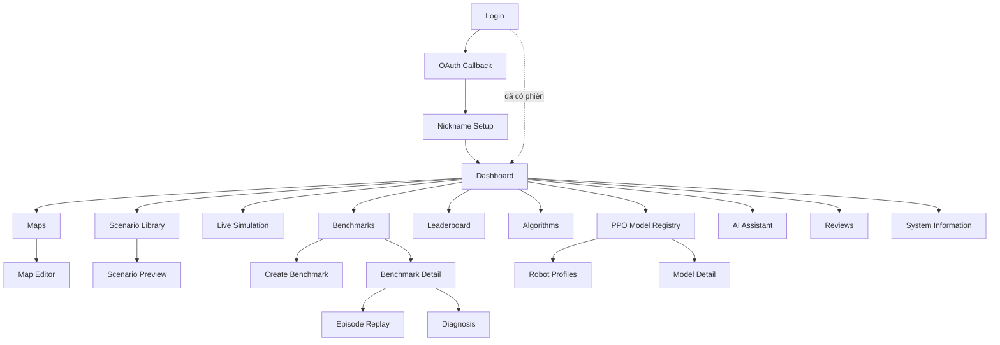
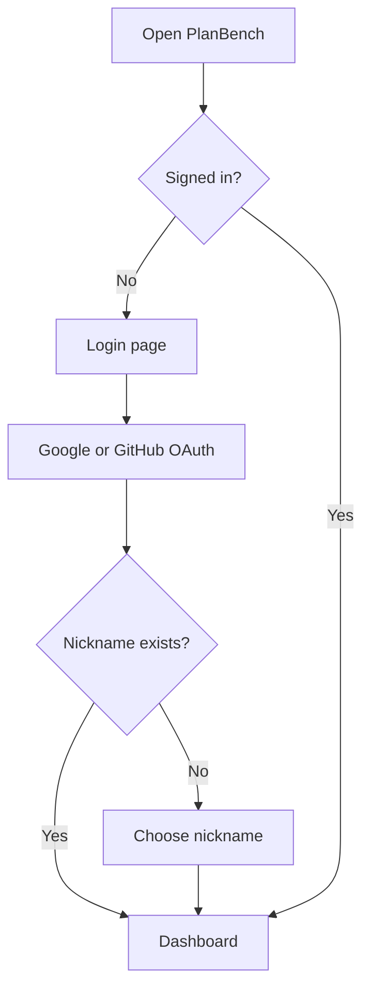
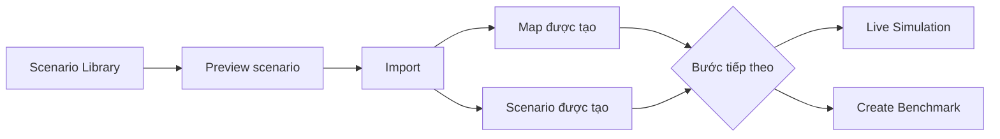
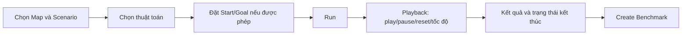
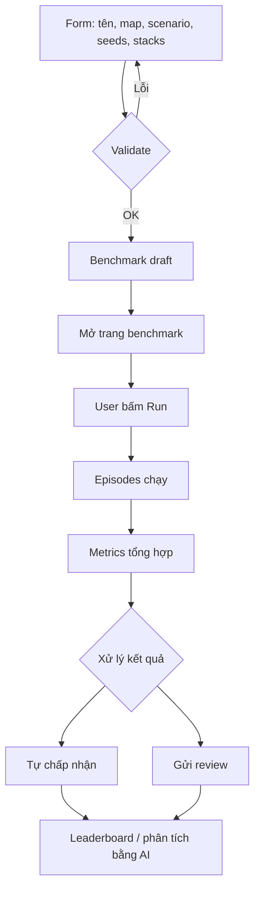
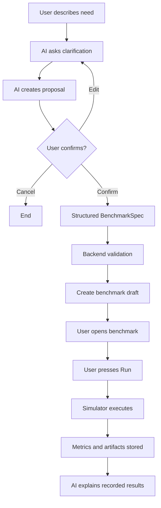
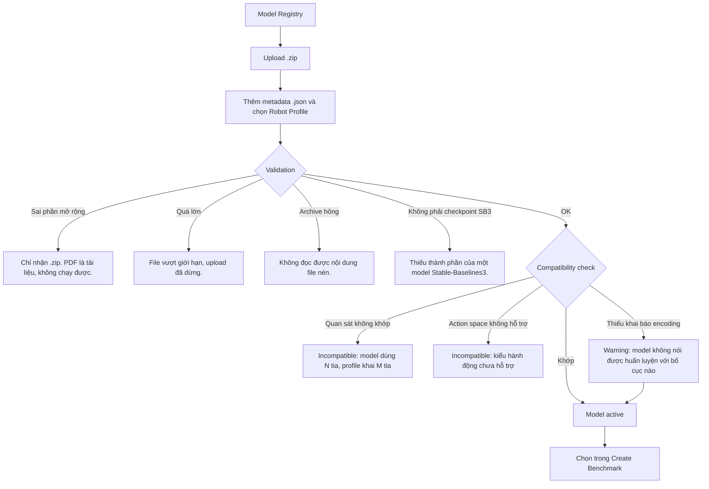
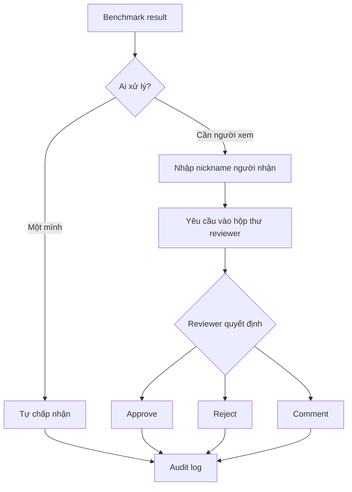
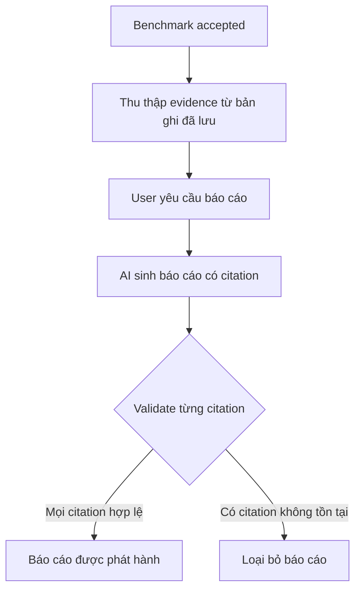
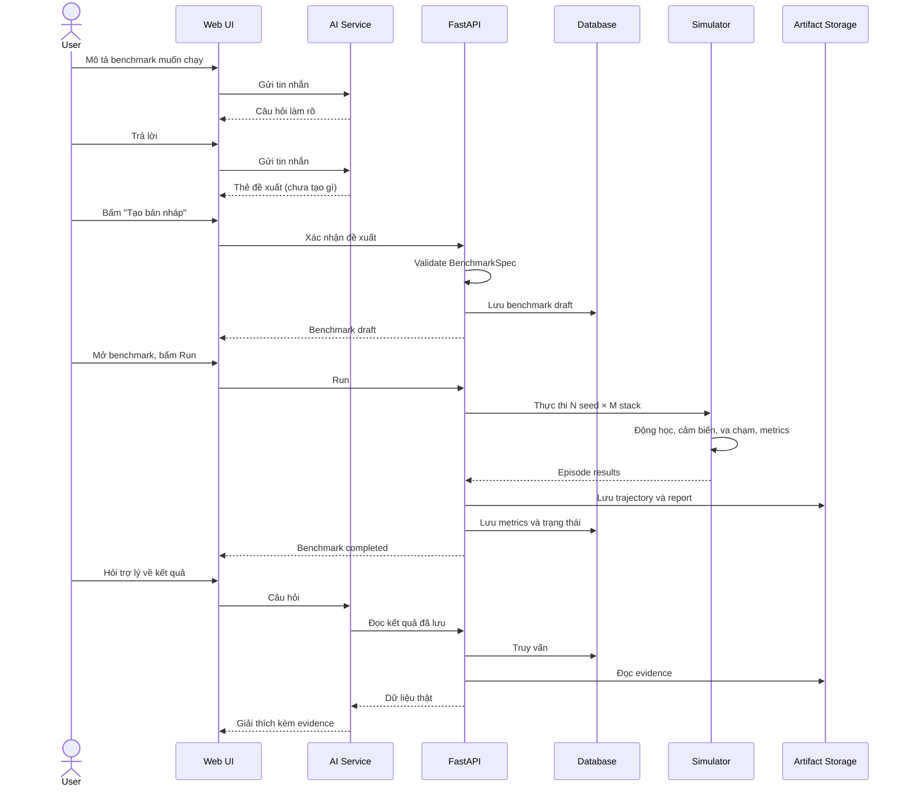

# Wireframe & UI Flow – RAV19 PlanBench

> Deliverable 3/4 – [Gate G1](./README.md)

## Mục lục

- [1. Mục tiêu thiết kế](#1-mục-tiêu-thiết-kế)
- [2. Design principles](#2-design-principles)
- [3. Sitemap](#3-sitemap)
- [4. Navigation structure](#4-navigation-structure)
- [5. Login flow](#5-login-flow)
- [6. Import scenario flow](#6-import-scenario-flow)
- [7. Live simulation flow](#7-live-simulation-flow)
- [8. Manual benchmark flow](#8-manual-benchmark-flow)
- [9. AI benchmark flow](#9-ai-benchmark-flow)
- [10. PPO Model Upload flow](#10-ppo-model-upload-flow)
- [11. Optional review flow](#11-optional-review-flow)
- [12. Evidence report flow](#12-evidence-report-flow)
- [13. Sequence diagram](#13-sequence-diagram)
- [14. Low-fidelity wireframes](#14-low-fidelity-wireframes)
- [15. Empty states](#15-empty-states)
- [16. Error states](#16-error-states)
- [17. Responsive behavior](#17-responsive-behavior)
- [18. Accessibility](#18-accessibility)
- [19. UI status mapping](#19-ui-status-mapping)
- [20. Screen implementation status](#20-screen-implementation-status)

---

## 1. Mục tiêu thiết kế

- **Đơn giản cho người mới.** Người chưa từng làm robotics phải tới được
  kết quả đầu tiên mà không cần đọc tài liệu.
- **Không phơi bày thông tin kỹ thuật không cần thiết**, nhưng vẫn mở ra
  được khi cần.
- **Vẫn phục vụ người chuyên môn.** `conditions_checksum` và latency thô
  phải lấy được.
- **Trợ lý giống chatbot thông thường.** Không bảng provider, không danh
  sách tool, không hướng dẫn cài đặt.
- **Giữ Human-in-the-loop.** Mọi hành động quan trọng có một nút và một
  người bấm.

---

## 2. Design principles

| Nguyên tắc | Áp dụng |
|---|---|
| **Progressive disclosure** | Thông tin xuất hiện khi cần. `conditions_checksum` nằm trong mục "Điều kiện chạy" mở ra được; latency thô nằm trong bảng chi tiết |
| **Clear primary action** | Mỗi màn hình có đúng một nút nổi bật. Trang benchmark ở trạng thái draft là **Chạy**; khi đã xong là **Chấp nhận kết quả** |
| **Evidence over claims** | Giao diện hiện số và điều kiện sinh ra số đó, cho mở bằng chứng; không tự kết luận thuật toán nào tốt hơn |
| **Human confirmation** | Không hành động không đảo ngược được nào xảy ra tự động |
| **Consistent terminology** | Map, Scenario, Benchmark, Episode, Stack — mỗi từ một nghĩa, dùng y hệt ở mọi nơi kể cả trong thông báo lỗi |
| **Responsive** | Bảng cuộn ngang trong khung riêng; thân trang không cuộn ngang |
| **Accessible** | Bàn phím đi được hết, focus nhìn thấy được, trạng thái luôn kèm chữ hoặc biểu tượng |

---

## 3. Sitemap



---

## 4. Navigation structure

### Sidebar

Nhóm theo việc người dùng đang làm, không theo cấu trúc kỹ thuật:

| Nhóm | Mục |
|---|---|
| **Không gian làm việc** | Tổng quan · Bản đồ · Thư viện kịch bản · Mô phỏng trực tiếp |
| **Kết quả** | Benchmark · Bảng xếp hạng · Thuật toán · Kho mô hình · Trợ lý AI |
| **Tài khoản** | Duyệt · Thông tin hệ thống |

Sidebar thu gọn được thành dải biểu tượng; trạng thái được nhớ giữa các
lần truy cập.

### Top bar

| Vị trí | Thành phần |
|---|---|
| Trái | Nút thu gọn sidebar (desktop) / hamburger (mobile), tiêu đề trang, breadcrumb |
| Phải | Chuyển VI/EN · Chuyển theme · Chuông thông báo review (có số) · Avatar và menu tài khoản |

Tiêu đề trang và breadcrumb lấy từ cùng một nguồn dữ liệu điều hướng
với sidebar.

---

## 5. Login flow



Nút của một provider chưa được cấu hình sẽ không hiện.

---

## 6. Import scenario flow



Sau khi import, người dùng được đưa thẳng tới hai lựa chọn tiếp theo
thay vì quay về danh sách.

---

## 7. Live simulation flow



Từ kết quả chạy thử có lối tắt sang tạo benchmark.

---

## 8. Manual benchmark flow



---

## 9. AI benchmark flow



Hai ranh giới bắt buộc trong luồng này:

- Giữa `P` và `S`: không có gì được tạo cho tới khi người dùng bấm.
- Giữa `D` và `R`: bản nháp không tự chạy; trợ lý không có endpoint nào
  để chạy nó.

---

## 10. PPO Model Upload flow



Nhánh `W3` là cảnh báo, không phải từ chối: phần lớn model không khai
báo bố cục quan sát, nhưng nếu bố cục không khớp thì policy sẽ đọc đầu
vào vô nghĩa mà vẫn chạy bình thường.

---

## 11. Optional review flow



Audit log ghi `self_approved` khác với `approve`, để phân biệt trường
hợp có và không có người thứ hai xem.

---

## 12. Evidence report flow



Nhánh `X`: báo cáo có citation không hợp lệ bị loại, không phát hành.

---

## 13. Sequence diagram



Trợ lý chỉ đọc qua `API`; không có mũi tên nào từ `AI` tới `SIM`.

---

## 14. Low-fidelity wireframes

### 14.1 Dashboard

```
┌──────────────┬────────────────────────────────────────────────────┐
│ PlanBench    │ Tổng quan            [VI/EN] [◐] [🔔2] [Avatar ▾]  │
│              ├────────────────────────────────────────────────────┤
│ KHÔNG GIAN   │ ┌─────────┐┌─────────┐┌─────────┐┌─────────┐       │
│ ▸ Tổng quan  │ │ Bản đồ  ││Kịch bản ││Benchmark││ Chờ     │       │
│ ▸ Bản đồ     │ │    4    ││   10    ││    7    ││ duyệt 2 │       │
│ ▸ Kịch bản   │ └─────────┘└─────────┘└─────────┘└─────────┘       │
│ ▸ Mô phỏng   │                                                    │
│              │ Bắt đầu nhanh                                      │
│ KẾT QUẢ      │ [Import kịch bản] [Mô phỏng thử] [Tạo benchmark]   │
│ ▸ Benchmark  │                                                    │
│ ▸ Xếp hạng   │ Benchmark gần đây                                  │
│ ▸ Thuật toán │ ┌────────────────────────────────────────────────┐ │
│ ▸ Kho mô hình│ │ doorway-dwa-vs-ppo   ● Đã hoàn tất   2 giờ trước│ │
│ ▸ Trợ lý AI  │ │ corridor-baseline    ● Đang chạy     5 phút    │ │
│              │ │ warehouse-3seed      ● Bản nháp      hôm qua   │ │
│ TÀI KHOẢN    │ └────────────────────────────────────────────────┘ │
│ ▸ Duyệt      │                                                    │
│ ▸ Hệ thống   │ Chờ bạn duyệt (2)                                  │
│              │ ┌────────────────────────────────────────────────┐ │
│ [◂ Thu gọn]  │ │ @hung gửi: narrow-corridor-ppo   [Xem]         │ │
│              │ └────────────────────────────────────────────────┘ │
│              │ Hệ thống: ● Hoạt động bình thường  [Chi tiết]      │
└──────────────┴────────────────────────────────────────────────────┘
```

Không có card lớn hiển thị URL backend; trạng thái hệ thống thu về một
dòng, chi tiết nằm ở trang Thông tin hệ thống.

### 14.2 Scenario Library

```
┌────────────────────────────────────────────────────────────────┐
│ Thư viện kịch bản                                              │
│ 10 kịch bản dựng sẵn. Import để dùng ngay, không cần tự vẽ.    │
├────────────────────────────────────────────────────────────────┤
│ ┌────────────────────────┐ ┌────────────────────────┐          │
│ │ narrow_corridor        │ │ doorway                │          │
│ │ Hành lang hẹp, robot   │ │ Cửa hẹp giữa hai phòng │          │
│ │ phải đi thẳng, ít chỗ  │ │ đòi hỏi căn chỉnh tốt  │          │
│ │ né tránh.              │ │                        │          │
│ │                        │ │                        │          │
│ │ Kích thước  12 × 8 m   │ │ Kích thước  10 × 10 m  │          │
│ │ Vật cản động  0        │ │ Vật cản động  0        │          │
│ │ Timeout      60 s      │ │ Timeout      45 s      │          │
│ │                        │ │                        │          │
│ │ [Xem trước] [Import]   │ │ [Xem trước] [Import]   │          │
│ └────────────────────────┘ └────────────────────────┘          │
│ ┌────────────────────────┐ ┌────────────────────────┐          │
│ │ dynamic_warehouse      │ │ intersection           │          │
│ │ ...  Vật cản động  3   │ │ ...  Vật cản động  2   │          │
│ └────────────────────────┘ └────────────────────────┘          │
└────────────────────────────────────────────────────────────────┘
```

### 14.3 Live Simulation

```
┌────────────────────────────────────────────────────────────────┐
│ Mô phỏng trực tiếp                                             │
├──────────────────────┬─────────────────────────────────────────┤
│ Bản đồ    [warehouse▾]│                                        │
│ Kịch bản  [doorway  ▾]│      ┌───────────────────────────┐     │
│ Thuật toán[A*+DWA   ▾]│      │ ███████        ███████    │     │
│                       │      │       ·····▸             │     │
│ Start  (1.0, 1.0)     │      │ ███  ·      ╲            │     │
│ Goal   (8.5, 6.0)     │      │      ·        ╲ ▲robot   │     │
│                       │      │ ███████        ███████    │     │
│ [▶ Chạy]              │      └───────────────────────────┘     │
│                       │      ···· Đường toàn cục (A*)          │
│ ── Điều khiển ──      │      ──── Quỹ đạo thực tế              │
│ [▶] [⏸] [↺]  1× [──○─]│                                        │
│                       ├─────────────────────────────────────────┤
│ ── Kết quả ──         │ Trạng thái   ● Thành công               │
│ Thời gian    12.4 s   │ Quãng đường  9.83 m                     │
│ Hiệu suất    0.87     │ Clearance nhỏ nhất  0.21 m              │
│                       │ [Tạo benchmark từ cấu hình này]         │
└──────────────────────┴─────────────────────────────────────────┘
```

### 14.4 Create Benchmark

```
┌────────────────────────────────────────────────────────────────┐
│ Tạo benchmark                                                  │
├────────────────────────────────────────────────────────────────┤
│ Tên          [doorway-dwa-vs-ppo                             ] │
│ Mô tả        [So sánh DWA và PPO ở cửa hẹp                   ] │
│                                                                │
│ Bản đồ       [warehouse-a                                   ▾] │
│ Kịch bản     [doorway                                       ▾] │
│ Robot        [Default AMR (r=0.3m, v=1.0m/s)                ▾] │
│                                                                │
│ Seeds        [1, 2, 3                                        ] │
│              Mỗi seed chạy một lượt cho mỗi thuật toán.        │
│                                                                │
│ Thuật toán   [x] A* + DWA                                      │
│              [x] A* + PPO                                      │
│              [ ] A* + Pure Pursuit  (tham chiếu, không dự thi) │
│                                                                │
│ ┌─ Model PPO (chỉ hiện khi chọn A* + PPO) ───────────────────┐ │
│ │ Model    [warehouse-ppo  v2                              ▾] │ │
│ │ ● Tương thích với Default AMR                              │ │
│ └────────────────────────────────────────────────────────────┘ │
│                                                                │
│ ▸ Điều kiện chạy (nâng cao)                                    │
│                                                                │
│                              [Hủy]  [Tạo bản nháp]             │
└────────────────────────────────────────────────────────────────┘
```

Khối model chỉ xuất hiện khi chọn A\*+PPO. Khi chưa có model nào, khối
này thành empty state với hai lối đi: *Tải model lên* hoặc *Dùng
A\*+DWA*.

### 14.5 PPO Model Registry

```
┌────────────────────────────────────────────────────────────────┐
│ Kho mô hình                                    [+ Tải model]   │
│ Model PPO đã huấn luyện, sẵn sàng để benchmark.                │
│ ⓘ PlanBench hiện hỗ trợ đánh giá model PPO đã được huấn luyện. │
│   Tính năng huấn luyện trực tiếp đang được phát triển.         │
├────────────────────────────────────────────────────────────────┤
│ Tên              Phiên bản  Robot         Kiểm tra    Trạng thái│
│ ─────────────────────────────────────────────────────────────── │
│ warehouse-ppo    v2         Default AMR   ● Hợp lệ    Đang bật  │
│ corridor-policy  v1         Narrow AMR    ● Hợp lệ    Đang bật  │
│ legacy-test      v1         Default AMR   ● Thất bại  Đã tắt    │
├────────────────────────────────────────────────────────────────┤
│ Robot Profile                              [+ Tạo profile]     │
│ Default AMR   r=0.30m  v=1.0m/s  ω=2.0rad/s  24 tia  6.0m      │
│ Narrow AMR    r=0.20m  v=0.6m/s  ω=1.5rad/s  32 tia  4.0m      │
└────────────────────────────────────────────────────────────────┘
```

**Không hiển thị đường dẫn nội bộ.** Model detail cho xem tên file gốc,
kích thước, checksum SHA-256, bố cục quan sát và danh sách benchmark đã
dùng nó.

### 14.6 AI Chatbot

```
┌─────────────────────────────────────────┐
│ Trợ lý PlanBench                        │
│ Tôi giúp chuẩn bị và phân tích benchmark│
├─────────────────────────────────────────┤
│ AI: Bạn muốn kiểm thử điều gì?          │
│ User: Robot trong nhà kho               │
│ AI: Bạn muốn dùng DWA hay PPO?          │
│                                         │
│ [Benchmark proposal card]               │
│ [Chỉnh sửa] [Tạo bản nháp]              │
├─────────────────────────────────────────┤
│ Nhập tin nhắn...                  [Gửi] │
└─────────────────────────────────────────┘
```

Thẻ đề xuất khi mở rộng:

```
┌─ Đề xuất benchmark ──────────────────────────┐
│ Kịch bản    dynamic_warehouse                │
│ Thuật toán  astar+dwa   astar+ppo            │
│ Model PPO   warehouse-ppo v2                 │
│ Seeds       1, 2, 3                          │
│                                              │
│ Đã giả định: dùng 3 seed mặc định vì bạn     │
│ chưa nêu số lượt.                            │
│                                              │
│              [Chỉnh sửa]  [Tạo bản nháp]     │
└──────────────────────────────────────────────┘
   Trợ lý không tự chạy benchmark. Bạn sẽ tự bấm Chạy.
```

**Không hiển thị:** tên provider hay model AI, API key, biến môi
trường, danh sách tool nội bộ, danh sách hành động bị cấm, đường dẫn
model, chẩn đoán kỹ thuật. Tất cả nằm ở trang **Thông tin hệ thống**.

### 14.7 Benchmark Result

```
┌────────────────────────────────────────────────────────────────┐
│ doorway-dwa-vs-ppo                        ● Đã hoàn tất         │
│ warehouse-a · doorway · 3 seed · 2 thuật toán                  │
├────────────────────────────────────────────────────────────────┤
│ ▸ Điều kiện chạy (checksum a3f9c1…)                            │
├────────────────────────────────────────────────────────────────┤
│ Thuật toán   Thành công  Va chạm  Timeout  Clearance  Thời gian│
│ ────────────────────────────────────────────────────────────── │
│ astar+dwa       100%        0%       0%     0.21 m     12.4 s  │
│ astar+ppo        67%       33%       0%     0.04 m      9.1 s  │
├────────────────────────────────────────────────────────────────┤
│ Episodes                                                       │
│ seed 1  astar+dwa  ● Thành công  12.1s  [Phát lại]             │
│ seed 1  astar+ppo  ● Va chạm      4.2s  [Phát lại] [Chẩn đoán] │
│ seed 2  astar+dwa  ● Thành công  12.6s  [Phát lại]             │
│ ...                                                            │
├────────────────────────────────────────────────────────────────┤
│ [Chấp nhận kết quả]  [Gửi duyệt]  [Hỏi trợ lý]                 │
└────────────────────────────────────────────────────────────────┘
```

Clearance được đặt cạnh success rate: trong ví dụ trên PPO nhanh hơn
nhưng đi sát vật cản 4 cm.

### 14.8 Review Inbox

```
┌────────────────────────────────────────────────────────────────┐
│ Duyệt                              [Đến tôi (2)] [Tôi đã gửi]  │
├────────────────────────────────────────────────────────────────┤
│ ┌────────────────────────────────────────────────────────────┐ │
│ │ @hung  ·  narrow-corridor-ppo                              │ │
│ │ Giai đoạn: Duyệt kết quả          Gửi 2 giờ trước          │ │
│ │ "Kết quả PPO thấp bất thường, xem giúp mình."              │ │
│ │                                                            │ │
│ │ [Mở benchmark]  [Đồng ý]  [Từ chối]  [Bình luận]           │ │
│ └────────────────────────────────────────────────────────────┘ │
│ ┌────────────────────────────────────────────────────────────┐ │
│ │ @lan   ·  warehouse-baseline                               │ │
│ │ Giai đoạn: Duyệt cấu hình         Gửi hôm qua              │ │
│ └────────────────────────────────────────────────────────────┘ │
└────────────────────────────────────────────────────────────────┘
```

---

## 15. Empty states

Mỗi empty state nói bước tiếp theo, không chỉ báo là trống.

| Tình huống | Tiêu đề | Nội dung và hành động |
|---|---|---|
| Chưa có map | "Chưa có bản đồ nào" | "Import một kịch bản dựng sẵn để có ngay bản đồ, hoặc tự vẽ." → [Mở thư viện] [Tạo bản đồ] |
| Chưa có benchmark | "Chưa có benchmark nào" | "Benchmark chạy nhiều seed trong điều kiện giống nhau để so sánh công bằng." → [Tạo benchmark] [Hỏi trợ lý] |
| Chưa có model PPO | "Chưa có model nào" | "PPO cần một model đã huấn luyện. Tải lên file .zip mà Stable-Baselines3 lưu bằng `model.save()`." → [Tải model lên] |
| Chưa có review | "Không có yêu cầu nào" | "Khi ai đó nhờ bạn xem một benchmark, nó sẽ xuất hiện ở đây." |
| Không có evidence | "Chưa đủ dữ liệu để lập báo cáo" | "Benchmark cần chạy xong và được chấp nhận trước khi lập báo cáo." → [Mở benchmark] |
| Chưa đăng nhập | "Bạn cần đăng nhập" | "Đăng nhập để tạo bản đồ, chạy benchmark và lưu kết quả." → [Đăng nhập] |
| Chọn PPO nhưng chưa có model | "Chưa có model PPO nào" | "Tải một model lên, hoặc chạy A\* + DWA trước." → [Tải model lên] [Dùng A\* + DWA] |

---

## 16. Error states

Thông báo lỗi nói chuyện gì xảy ra và làm gì tiếp theo, bằng ngôn ngữ
của người dùng.

| Không hiển thị | Hiển thị thay bằng |
|---|---|
| `invalid config for astar+ppo: model_path Field required` | "Bạn chưa chọn PPO model. Hãy chọn model đã tải lên hoặc dùng A\* + DWA." |
| `missing bearer token` | "Bạn cần đăng nhập để sử dụng tính năng này." |
| `403 Forbidden` | "Bạn không có quyền thao tác trên benchmark này." |
| `ValidationError: origin.theta` | "Bản đồ có gốc tọa độ xoay chưa được hỗ trợ." |
| `413 Payload Too Large` | "File vượt quá giới hạn 200 MB. Upload đã được dừng lại." |
| `BadZipFile` | "Không đọc được nội dung file nén. Hãy kiểm tra lại file." |
| `ModuleNotFoundError: stable_baselines3` | "Máy chủ này chưa cài phụ thuộc để chạy PPO. Hãy cài từ requirements-optional.txt, hoặc chạy A\* + DWA." |
| `WebSocket disconnected` | "Mất kết nối tới máy chủ mô phỏng." → [Thử lại] |

Lỗi hiển thị trong khung có màu, biểu tượng và chữ, không chỉ dùng
màu.

---

## 17. Responsive behavior

### Desktop (≥ 1024px)

- Sidebar mở rộng mặc định, thu gọn thành dải biểu tượng được; trạng
  thái được nhớ.
- Bố cục nhiều cột: form và canvas cạnh nhau ở Live Simulation.
- Bảng hiện đủ cột.

### Tablet (640–1023px)

- Sidebar mặc định thu gọn.
- Card hai cột.
- Live Simulation: canvas trên, điều khiển dưới.

### Mobile (< 640px)

- Sidebar thành **drawer**, mở bằng nút hamburger, đóng khi chọn mục
  hoặc bấm ra ngoài.
- Card **một cột**.
- Bảng **cuộn ngang trong khung riêng**; thân trang không bao giờ cuộn
  ngang.
- Chatbot chiếm **toàn bộ chiều cao**, ô nhập neo ở đáy.
- Điều khiển mô phỏng xuống dòng thay vì tràn ra ngoài.
- Vùng chạm tối thiểu 44×44 px.

---

## 18. Accessibility

- **Điều hướng bằng bàn phím** đi hết mọi chức năng; thứ tự tab theo thứ
  tự đọc.
- **Focus nhìn thấy được** trên mọi phần tử tương tác, kể cả trong theme
  tối.
- **Nhãn ARIA** cho nút chỉ có biểu tượng; vùng hội thoại có
  `role="log"` và `aria-live="polite"`; thanh tiến trình có
  `role="progressbar"`.
- **Tương phản màu** đạt WCAG AA cho chữ thường và chữ lớn ở cả hai
  theme.
- **Tooltip cho biểu tượng** khi sidebar thu gọn.
- **Trạng thái không bao giờ chỉ bằng màu**, luôn kèm chữ hoặc hình
  dạng.
- **Ảnh và canvas** có mô tả thay thế nêu nội dung.

---

## 19. UI status mapping

| Trạng thái | Tiếng Việt | English | Gợi ý thị giác |
|---|---|---|---|
| `draft` | Bản nháp | Draft | Xám, viền đứt |
| `running` | Đang chạy | Running | Xanh dương, có spinner |
| `pending_review` | Chờ duyệt | Pending review | Vàng, biểu tượng đồng hồ |
| `accepted` | Đã chấp nhận | Accepted | Xanh lá, dấu tích |
| `rejected` | Đã từ chối | Rejected | Đỏ, dấu chéo |
| `success` | Thành công | Success | Xanh lá, dấu tích |
| `collision` | Va chạm | Collision | Đỏ, dấu chấm than |
| `stuck` | Bị kẹt | Stuck | Cam, biểu tượng khóa |
| `timeout` | Quá thời gian | Timeout | Cam, đồng hồ |
| `compatible` | Tương thích | Compatible | Xanh lá, dấu tích |
| `incompatible` | Không tương thích | Incompatible | Đỏ, dấu chéo |
| `warning` | Có cảnh báo | Warning | Vàng, tam giác |

Cột "gợi ý thị giác" là bổ sung cho chữ, không thay thế chữ.

---

## 20. Screen implementation status

Đối chiếu với mã nguồn thật.

| Screen | Status | Route or module |
|---|---|---|
| Dashboard | Completed | `apps/web/src/app/page.tsx` |
| Login | Completed | `apps/web/src/app/login/page.tsx` |
| OAuth Callback | Completed | `apps/web/src/app/auth/callback/page.tsx` |
| Nickname Setup | Completed | `apps/web/src/app/welcome/page.tsx` |
| Maps | Completed | `apps/web/src/app/maps/page.tsx` |
| Map Editor | Completed | `apps/web/src/app/maps/[id]/page.tsx`, `apps/web/src/components/MapCanvas.tsx` |
| Scenario Library | Completed | `apps/web/src/app/library/page.tsx` |
| Live Simulation | Completed | `apps/web/src/app/simulate/page.tsx` |
| Benchmarks | Completed | `apps/web/src/app/benchmarks/page.tsx` |
| Benchmark Detail + Replay + Diagnosis | Completed | `apps/web/src/app/benchmarks/[id]/page.tsx`, `apps/web/src/components/FailureFindings.tsx`, `.../MetricsPanel.tsx` |
| Leaderboard | Completed | `apps/web/src/app/leaderboard/page.tsx` |
| Algorithms | Completed | `apps/web/src/app/algorithms/page.tsx` |
| PPO Model Registry | Completed | `apps/web/src/app/models/page.tsx`, `apps/web/src/components/ModelUpload.tsx` |
| Model Detail | Completed | `apps/web/src/app/models/[id]/page.tsx` |
| AI Assistant | Completed | `apps/web/src/app/agent/page.tsx` |
| Reviews | Completed | `apps/web/src/app/reviews/page.tsx` |
| System Information | Completed | `apps/web/src/app/system/page.tsx` |
| Hiển thị 2.5D | Completed | `apps/web/src/components/Scene25D.tsx` |
| Robot Profiles (màn hình riêng) | In progress | Quản lý trong `apps/web/src/app/models/page.tsx`; chưa tách thành route riêng |
| Scenario Preview (màn hình riêng) | In progress | Xem trước nằm trong `apps/web/src/app/library/page.tsx`; chưa có route riêng |
| Lịch sử hội thoại | In progress | Backend đầy đủ; giao diện mới có "Cuộc trò chuyện mới" |
| Trang huấn luyện PPO | Planned | Chưa có: không dựng giao diện huấn luyện khi chưa có job huấn luyện thật |
