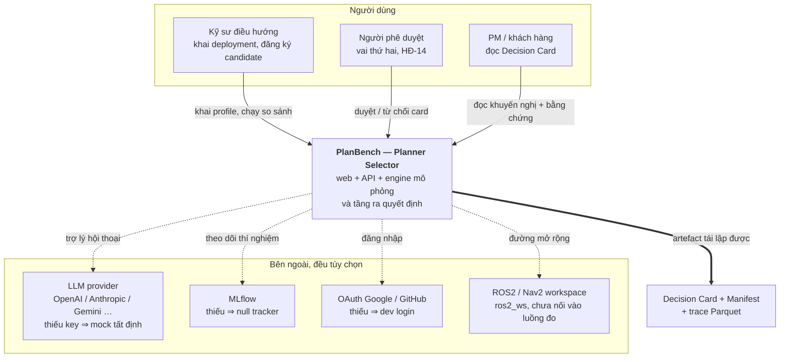
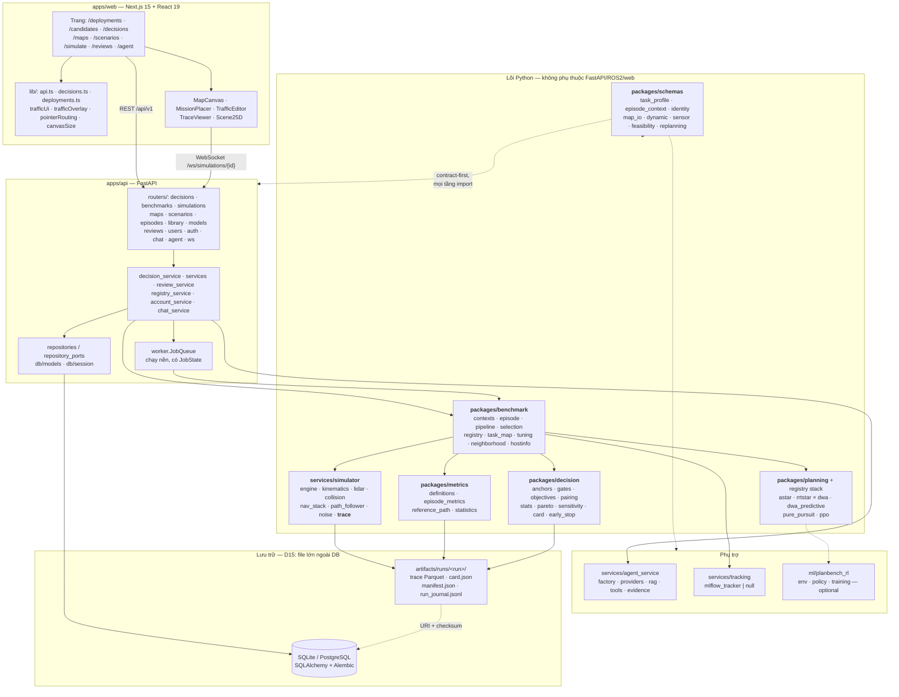
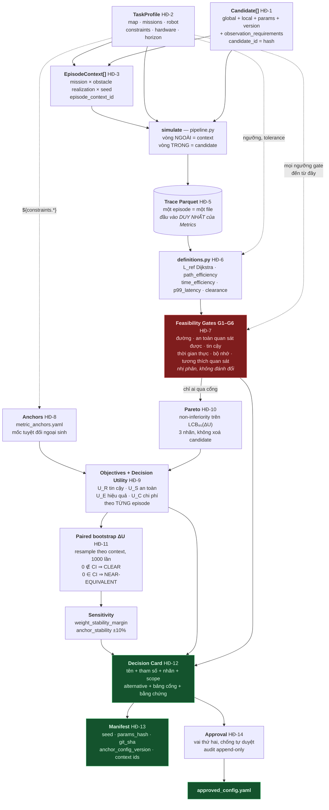
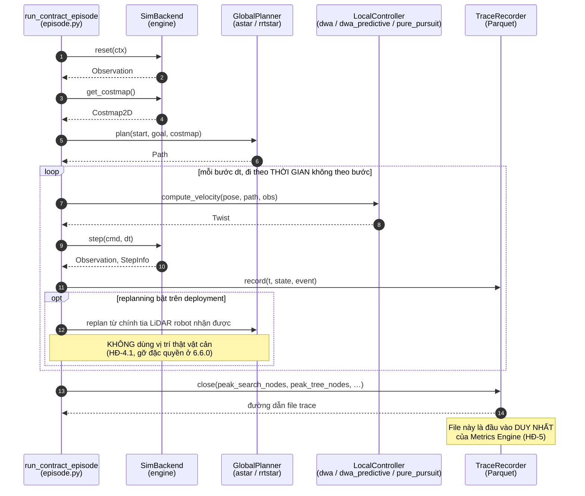
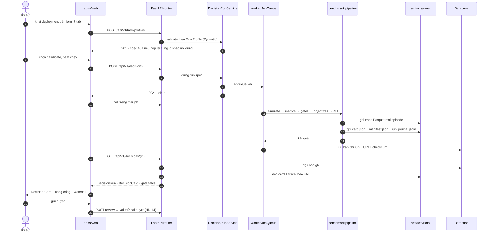
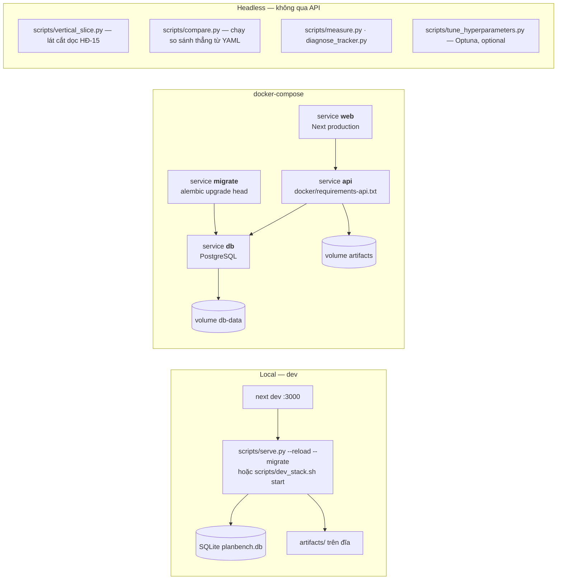

# Sơ đồ kiến trúc — PlanBench / Planner Selector

> **Ngày lập:** 2026-08-16 · **Nhánh:** `tongduyan_plannerselector`
> **Nguồn sự thật:** `contracts/CONTRACTS.md` (HĐ-1 … HĐ-15). Khi tài liệu
> này mâu thuẫn với contract, **contract thắng**.
> **Quan hệ với tài liệu khác** *(cập nhật 2026-08-31)*: `ARCHITECTURE.md`
> ở gốc repo **đã được viết lại 2026-08-23** và nay là sơ đồ kiến trúc hiện
> hành — mô tả "template T-011 chưa điền (LangGraph + ChromaDB)" trong bản
> gốc của dòng này không còn đúng. `docs/architecture.md` (dừng ở Giai đoạn
> 1A) đã chuyển vào `docs/archive/superseded/`; nhật ký quyết định D01–D15
> của nó được tách ra `docs/reference/decision-log.md` vì code còn trích.
> `docs/architecture_diagram.md` **chưa từng tồn tại** trong cây này.
> File này giữ vai **nguồn chi tiết về toán, ký hiệu và ánh xạ HĐ**;
> bản định hướng ngắn là `docs/01-architecture.md`.

---

## 0. Một câu về hệ thống

Hệ thống nhận **một deployment profile** (bản đồ, nhiệm vụ, robot, phần
cứng, ràng buộc vận hành) cùng **một tập candidate** (cấu hình điều hướng
hoàn chỉnh), chạy mô phỏng ghép cặp trên cùng tập episode, rồi trả về
**đúng một khuyến nghị** kèm bằng chứng thống kê và biên sai số của chính
khuyến nghị đó.

```
c* = argmax U(c | T, H, P)      c ∈ C_feasible
```

Điều đó định hình toàn bộ kiến trúc: mọi thành phần tồn tại để **một tấm
Decision Card tái lập được**, chứ không phải để "chạy simulator".

---

## 1. Bối cảnh hệ thống (Level 1)



Ba mũi tên nét đứt là **suy giảm có kiểm soát**: thiếu chúng thì tính năng
tương ứng hạ chế độ và **nói rõ**, không crash (xem `requirements-optional.txt`).

---

## 2. Kiến trúc thành phần (Level 2)



**Ba luật đọc được từ sơ đồ:**

1. **Mũi tên không bao giờ đi ngược từ lõi lên API.** `packages/` và
   `services/simulator` không import FastAPI. Đó là điều kiện để cùng một
   engine chạy được ở ba chế độ: trong API, headless qua `scripts/`, và
   (tương lai) node ROS2.
2. **`packages/schemas` là nguồn sự thật duy nhất của domain.** Pydantic,
   không phải bảng SQL, không phải TypeScript interface.
3. **`artifacts/` và database phải backup cùng nhau.** Bảng chỉ giữ URI +
   checksum; mất thư mục artifact thì database còn nguyên nhưng mọi lần
   phát lại đều báo thiếu file.

---

## 3. Chuỗi giá trị — từ profile tới khuyến nghị

Đây là sơ đồ quan trọng nhất của dự án. Thứ tự **không** đảo được: cổng
đứng trước chấm điểm, Pareto đứng trước utility, utility đứng trước thống kê.



### Vì sao thứ tự này bất di bất dịch

| Bước | Nếu đảo thì hỏng gì |
|---|---|
| Gate **trước** Score | Ứng viên va chạm 1,7% mà nhanh gấp 3 sẽ thắng điểm. An toàn không được phép đem ra đánh đổi (N4) |
| Anchor **tuyệt đối**, không min-max theo tập ứng viên | Thêm một ứng viên tệ vào có thể lật thứ hạng hai ứng viên đầu — *rank reversal* (N2) |
| Pareto **trước** Utility | Candidate bị lấn át vẫn ngoi lên được nếu trọng số bị chỉnh lệch (N10) |
| Objective tính **theo từng episode** | Không tính được ΔU ghép cặp; mất luôn lợi thế phương sai chung (N8) |
| Bootstrap **ghép cặp**, không so hai CI rời | Hai CI chồng nhau vẫn có thể đi kèm hiệu số khác 0 rõ rệt — kết luận quá bảo thủ |

### Vì sao vòng ngoài là context, vòng trong là candidate

Ghi rõ vì đây là chỗ dễ code ngược nhất (`pipeline.simulate`, HĐ-3.2):

- **Ngắt giữa chừng.** Candidate-outer mà dừng nửa chừng: candidate đầu có
  đủ episode, candidate cuối không có gì — dữ liệu vô dụng. Context-outer
  dừng nửa chừng: mọi candidate có **cùng** tập episode, phép so vẫn hợp
  lệ, chỉ nhỏ hơn.
- **Trôi máy.** Candidate-outer đặt một candidate ở nửa đầu đồng hồ tường,
  candidate kia ở nửa sau — mọi throttling nhiệt rơi trọn lên một bên.
  Xen kẽ làm mọi candidate chia nhau đúng trạng thái máy, từng phút một.

---

## 4. Vòng lặp một episode — bốn interface HĐ-4

Không thành phần nào được import trực tiếp thành phần khác ngoài qua bốn
giao thức này. Đường **`Observation`** là ranh giới công bằng: một planner
gọi thẳng vào nội tại `SimBackend` để lấy vị trí vật cản vừa là vi phạm
kiến trúc, vừa là gian lận về lớp quan sát (G6).



**Biến thể `monolithic`:** candidate RL end-to-end không có tách
global/local. Runner gọi `MonolithicPolicy.act(pose, goal, obs)` thay cho
cặp `GlobalPlanner` + `LocalController`, vẫn đi qua **đúng sáu cổng**.
Adapter phía simulator đã có; **registry policy còn nợ** — hôm nay
candidate `monolithic` khai được mà chưa dựng được (L2).

---

## 5. Luồng một request thật — chạy so sánh từ trình duyệt



Phát lại quỹ đạo đi đường riêng: `WebSocket /ws/simulations/{id}`, có
tham số `speed` và `pace` — không nằm dưới prefix `/api/v1`.

---

## 6. Hai chế độ chạy



**Ba bất đối xứng cố ý, đừng "sửa":**

| Chỗ | Khác gì | Lý do |
|---|---|---|
| `docker/requirements-api.txt` thiếu `psutil` | Image là Linux, có `os.sched_setaffinity` sẵn | Nhánh psutil không với tới được. Nhưng **giữ** nó trong `requirements.txt`, nếu không mọi run Windows chạy không ghim nhân (HĐ-7.4) |
| Image API thiếu `torch` | Training là workload riêng | Kéo torch vào image API là thêm vài GB cho code API không bao giờ chạy. Hệ quả: stack `astar+ppo` **không** chạy được từ image này |
| `scripts/compare.py` nạp YAML thẳng từ path | Đi vòng qua guard "nộp lại profile đã đổi" của luồng API | **Đây là nợ, không phải thiết kế** — L19, đang chờ vá ở pha Q1 |

---

## 7. Ranh giới hợp đồng — đọc trước khi sửa

Ba thứ CONTRACTS khoá cứng; đổi = MAJOR bump + mọi dữ liệu đã ghi mồ côi.

| # | Khoá | Ở đâu | Đổi thì gãy gì |
|---|---|---|---|
| 1 | `candidate_id` = hash(global + local + params + version + observation_requirements) | `packages/decision/candidate.py` | Mọi trace, pairing, ΔU, card tham chiếu id này |
| 2 | `episode_context_id` = (task profile, mission, variant, seed) | `packages/schemas/episode_context.py` | Luật ghép cặp — nền của mọi thống kê ΔU |
| 3 | Trace schema Parquet | `services/simulator/trace.py` | Thiếu một cột là phải chạy lại **toàn bộ** episode |

**Cái bẫy đã sập hai lần và vẫn còn mở:** `episode_context_id` **không**
băm `environment`. Đổi cảm biến hay `v_obstacle_max` trong profile mà giữ
nguyên `task_profile_id` cho ra hai thế giới khác nhau dưới **cùng một
context id**, journal nối đuôi nhau, người đọc kết luận episode chập chờn.
Luật hiện hành: *đổi profile ⇒ `task_profile_id` mới*. Guard nằm ở luồng
API và `compare.py` đi vòng qua nó (L19).

---

## 8. Bảng tra thành phần

| Thành phần | Đường dẫn | Vai |
|---|---|---|
| Schema domain | `packages/schemas/planbench_schemas/` | Nguồn sự thật Pydantic cho mọi tầng |
| Sinh context | `packages/benchmark/contexts.py` | HĐ-3, `episode_context_id`, kế hoạch chạy |
| Chạy episode | `packages/benchmark/episode.py` | Ghép candidate × context × map → trace |
| Điều phối sweep | `packages/benchmark/pipeline.py` | `simulate` · `gate_all` · `score_survivors` · `decide` |
| Đầu vào CLI | `packages/benchmark/selection.py` | `run_comparison`, `assemble_card`, early-stop |
| Registry stack | `packages/benchmark/registry.py` | 7 stack: astar/rrtstar × dwa/dwa_predictive/pure_pursuit, + astar+ppo |
| Simulator | `services/simulator/planbench_simulator/` | engine · kinematics · lidar · collision · nav_stack · trace |
| Metric | `packages/metrics/definitions.py` | **Nơi duy nhất** định nghĩa metric (HĐ-6) |
| Quyết định | `packages/decision/` | anchors · gates · objectives · pairing · stats · pareto · sensitivity · card |
| API | `apps/api/planbench_api/` | 16 router + service + JobQueue + repository |
| Web | `apps/web/src/` | 17 trang, canvas tương tác, i18n vi/en |
| Trợ lý AI | `services/agent_service/` | factory chọn provider; không key ⇒ mock tất định |
| Theo dõi | `services/tracking/` | MLflow hoặc null tracker |
| RL | `ml/planbench_rl/` | env · policy · training (optional) |
| ROS2 | `ros2_ws/src/` | bridge · simulator_node · benchmark_runner · nav2_bringup — build bằng colcon, **không** nằm trong luồng đo hiện tại |

---

## 9. Cái sơ đồ này **không** vẽ

Nói rõ để không ai đọc thừa:

- **L2/L3 scope** (mission distribution, Task Neighborhood K=20) — đã có
  `neighborhood.py` nhưng chưa nằm trong luồng chính; MVP chạy L1
  mission-level.
- **Racing / Adaptive Scheduler** (N9) — cố ý chưa làm, episode 2D quá rẻ
  để cần tới.
- **Target Verifier** cho pha 2 của G4/G5 — chưa có bo mạch đích, nên mọi
  card hiện ghi `screened_on_host`, **không** được phát biểu là đạt thời
  gian thực.
- **Registry policy** cho candidate `monolithic` — nửa còn lại của adapter.
- **ROS2 closed-loop** — `ros2_ws/` tồn tại nhưng chưa là một `SimBackend`
  thay thế được trong luồng đo.
